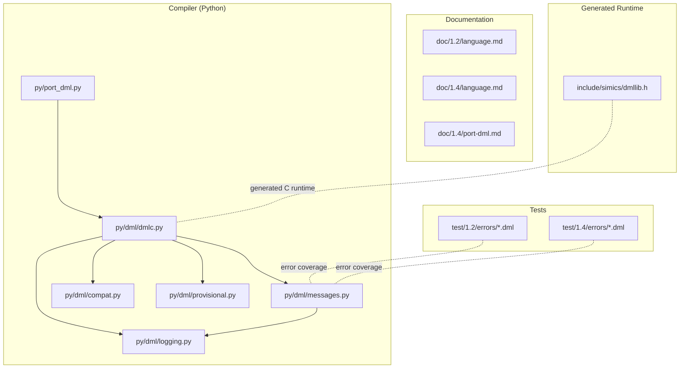
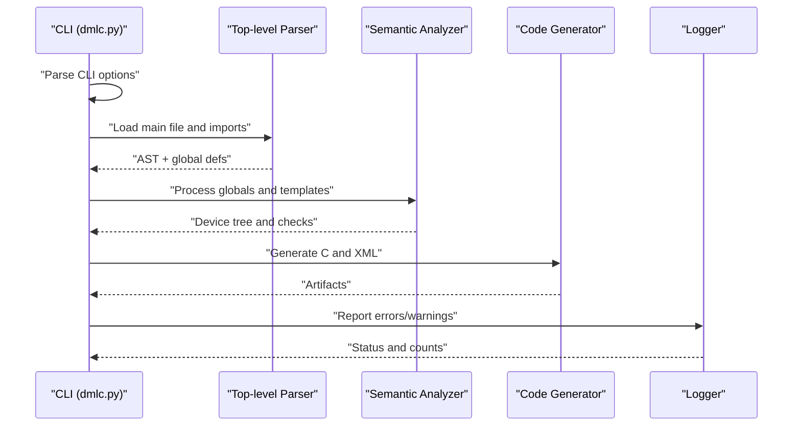
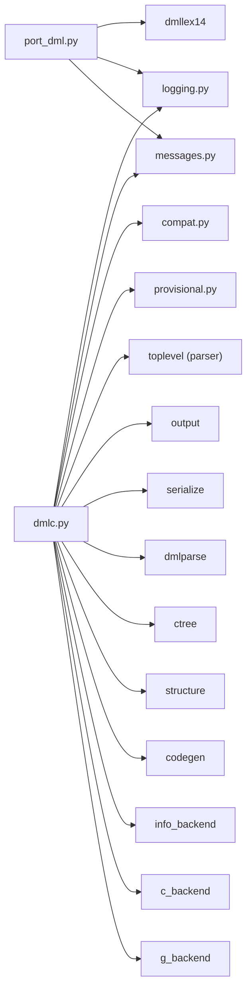

# Reference Materials

<cite>
**Referenced Files in This Document**
- [README.md](file://README.md)
- [py/dml/__init__.py](file://py/dml/__init__.py)
- [py/dml/dmlc.py](file://py/dml/dmlc.py)
- [py/dml/messages.py](file://py/dml/messages.py)
- [py/dml/logging.py](file://py/dml/logging.py)
- [py/dml/compat.py](file://py/dml/compat.py)
- [py/dml/provisional.py](file://py/dml/provisional.py)
- [py/port_dml.py](file://py/port_dml.py)
- [include/simics/dmllib.h](file://include/simics/dmllib.h)
- [doc/1.2/language.md](file://doc/1.2/language.md)
- [doc/1.4/language.md](file://doc/1.4/language.md)
- [doc/1.4/port-dml.md](file://doc/1.4/port-dml.md)
- [test/1.2/errors](file://test/1.2/errors)
- [test/1.4/errors](file://test/1.4/errors)
</cite>

## Table of Contents
1. [Introduction](#introduction)
2. [Project Structure](#project-structure)
3. [Core Components](#core-components)
4. [Architecture Overview](#architecture-overview)
5. [Detailed Component Analysis](#detailed-component-analysis)
6. [Dependency Analysis](#dependency-analysis)
7. [Performance Considerations](#performance-considerations)
8. [Troubleshooting Guide](#troubleshooting-guide)
9. [Conclusion](#conclusion)
10. [Appendices](#appendices)

## Introduction
This document is a comprehensive reference for the Device Modeling Language (DML). It consolidates:
- Error messages and codes with detailed descriptions, typical causes, and resolutions
- Python API reference for the DML compiler and porting tools
- Command-line interface specifications for dmlc
- Configuration options and environment variables
- Migration resources including compatibility features, porting tools, and best practices
- Cross-references and lookup patterns for quick developer access

## Project Structure
The repository is organized into:
- Documentation for DML 1.2 and 1.4
- Python compiler implementation (dmlc) and supporting modules
- Standard library headers for generated C runtime utilities
- Test suites for error coverage and regression checks
- Porting tooling for migrating DML 1.2 to 1.4

**Diagram sources**
- [py/dml/dmlc.py](file://py/dml/dmlc.py#L309-L800)
- [py/dml/logging.py](file://py/dml/logging.py#L100-L252)
- [py/dml/messages.py](file://py/dml/messages.py#L1-L800)
- [py/dml/compat.py](file://py/dml/compat.py#L1-L432)
- [py/dml/provisional.py](file://py/dml/provisional.py#L1-L148)
- [py/port_dml.py](file://py/port_dml.py#L1-L800)
- [include/simics/dmllib.h](file://include/simics/dmllib.h#L1-L3561)
- [doc/1.2/language.md](file://doc/1.2/language.md#L1-L800)
- [doc/1.4/language.md](file://doc/1.4/language.md#L1-L800)
- [doc/1.4/port-dml.md](file://doc/1.4/port-dml.md#L1-L77)

**Section sources**
- [README.md](file://README.md#L1-L117)
- [py/dml/__init__.py](file://py/dml/__init__.py#L1-L5)

## Core Components
- dmlc: The DML compiler CLI and Python driver
- Logging and messages: Centralized error/warning/reporting infrastructure
- Compatibility features: Controlled feature toggles for API version migration
- Provisional features: Experimental feature gates
- Porting tool: Automated migration from DML 1.2 to 1.4
- Generated runtime header: C utilities used by generated device models

Key responsibilities:
- Parse DML, type-check, and generate C code
- Report structured errors and warnings with source locations
- Provide migration aids and compatibility shims
- Offer AI-friendly diagnostics and profiling hooks

**Section sources**
- [py/dml/dmlc.py](file://py/dml/dmlc.py#L309-L800)
- [py/dml/logging.py](file://py/dml/logging.py#L100-L252)
- [py/dml/messages.py](file://py/dml/messages.py#L1-L800)
- [py/dml/compat.py](file://py/dml/compat.py#L1-L432)
- [py/dml/provisional.py](file://py/dml/provisional.py#L1-L148)
- [py/port_dml.py](file://py/port_dml.py#L1-L800)
- [include/simics/dmllib.h](file://include/simics/dmllib.h#L1-L3561)

## Architecture Overview
The compiler pipeline:
1. CLI parses options and sets global modes
2. Parser loads files and constructs ASTs
3. Semantic analysis validates types, templates, and compatibility
4. Code generation emits C and auxiliary artifacts
5. Logging aggregates errors and warnings

**Diagram sources**
- [py/dml/dmlc.py](file://py/dml/dmlc.py#L309-L760)
- [py/dml/logging.py](file://py/dml/logging.py#L433-L468)

## Detailed Component Analysis

### Error Messages and Codes Reference
This section catalogs error classes and typical patterns. Each entry includes:
- Error class name and brief description
- Typical causes and common symptoms
- Resolution strategies
- Related warning tags and CLI flags

Common categories:
- Syntax and parsing errors
- Type mismatches and invalid expressions
- Imports and cyclic dependencies
- Method and template issues
- Register and layout problems
- Attribute and checkpointing constraints
- Warnings and diagnostics

Representative entries (non-exhaustive):
- EAFTER: Illegal after statement binding or serialization constraints
- ECYCLICIMP: Cyclic import detected
- EAMBINH: Conflicting method/parameter definitions
- ETYPE/ETREC: Unknown or recursive types
- EASSIGN/EINVALID: Assignment target not an l-value
- EBINOP/EBTYPE: Binary operator/type mismatch
- EBSLICE/EBSBE: Bitslice misuse or uncertain widths
- EOOB/ENARRAY: Array indexing out of bounds or invalid index
- EREGVAL: Register with fields used as scalar value
- EANAME/EATYPE: Illegal attribute name or undefined type
- EDEVICE: Missing device declaration
- ESYNTAX: General syntax error with token context
- EEXPORT/ESTATICEXPORT: Export restrictions on methods
- EHOOKTYPE/EAFTERHOOK: Hook message component type restrictions
- ESIMAPI: DML version/API mismatch
- WLOGMIXUP: Log statement pattern warning (compatibility-controlled)

Resolution strategies:
- Review source location and fix type/signature mismatches
- Ensure imports are resolvable and acyclic
- Align method signatures and template inheritance
- Correct register field definitions and access patterns
- Fix attribute definitions and checkpoint requirements
- Adjust method visibility/export rules
- Revisit hook message component types and serialization
- Use appropriate DML version and API flags

**Section sources**
- [py/dml/messages.py](file://py/dml/messages.py#L27-L800)
- [py/dml/logging.py](file://py/dml/logging.py#L100-L252)
- [test/1.2/errors](file://test/1.2/errors)
- [test/1.4/errors](file://test/1.4/errors)

### Python API Reference
Primary modules and entry points:
- dmlc: Command-line entry point and option parsing
- logging: Error/warning/reporting framework
- messages: Error and warning classes
- compat: Compatibility feature registry and toggles
- provisional: Provisional feature registry
- port_dml: DML 1.2 to 1.4 porting tool

Key APIs:
- dmlc.main(argv): Parses CLI and orchestrates compilation
- logging.report(message): Central reporting function
- messages.<ErrorClass>(site, ...): Instantiate specific errors
- compat.features: Compatibility feature map
- provisional.features: Provisional feature map
- port_dml.SourceFile: File transformation engine
- include/simics/dmllib.h: Generated C runtime utilities

Usage patterns:
- Construct error instances with site information and report via logging
- Enable/disable compatibility features via CLI or programmatically
- Apply transformations to migrate DML 1.2 to 1.4

**Section sources**
- [py/dml/dmlc.py](file://py/dml/dmlc.py#L309-L800)
- [py/dml/logging.py](file://py/dml/logging.py#L433-L468)
- [py/dml/messages.py](file://py/dml/messages.py#L1-L800)
- [py/dml/compat.py](file://py/dml/compat.py#L42-L432)
- [py/dml/provisional.py](file://py/dml/provisional.py#L24-L148)
- [py/port_dml.py](file://py/port_dml.py#L82-L800)
- [include/simics/dmllib.h](file://include/simics/dmllib.h#L1-L3561)

### Command-Line Interface Specifications
Core options (selected):
- -I PATH: Add import search path
- -D NAME=VALUE: Define compile-time parameter
- --dep TARGET: Emit makefile dependencies
- --no-dep-phony: Suppress phony targets in dep generation
- --dep-target TARGET: Set dependency generation target(s)
- -T: Show warning tags
- -g: Generate debuggable artifacts
- --warn TAG/--nowarn TAG: Control specific warnings
- --werror: Treat warnings as errors
- --strict-dml12/--strict-int: Aliases for compatibility toggles
- --coverity: Add Coverity annotations
- --noline: Suppress line directives
- --info: Generate XML register layout
- --simics-api VERSION: Select Simics API version
- --max-errors N: Limit error reporting
- --no-compat TAG: Disable compatibility feature
- --help-no-compat: List compatibility tags
- --ai-json FILE: Export AI-friendly diagnostics
- -P FILE: Append porting messages to tag file
- --state-change-dml12: Internal testing flag
- --split-c-file N: Split generated C files by size
- --enable-features-for-internal-testing-dont-use-this: Internal-only
- positional: input.dml [output_base]

Behavioral notes:
- Combining -P with --dep or -g is disallowed
- --max-errors accepts non-negative integers
- --split-c-file accepts non-negative integers
- --simics-api must match known API versions

**Section sources**
- [py/dml/dmlc.py](file://py/dml/dmlc.py#L313-L518)

### Configuration Options and Environment Variables
Environment variables:
- DMLC_DIR: Directory containing dmlc binaries for linking
- T126_JOBS: Parallel test jobs
- DMLC_PATHSUBST: Rewrite error paths to source copies
- PY_SYMLINKS: Symlink Python files instead of copying
- DMLC_DEBUG: Print unexpected exceptions to stderr
- DMLC_CC: Override default compiler in tests
- DMLC_PROFILE: Enable self-profiling
- DMLC_DUMP_INPUT_FILES: Produce tarball of inputs for isolated builds
- DMLC_GATHER_SIZE_STATISTICS: Emit code-size statistics

Recommendations:
- Set DMLC_DIR to bin directory for local builds
- Use DMLC_PATHSUBST to map copied library paths back to sources
- Enable PY_SYMLINKS during development for accurate tracebacks
- Use DMLC_DUMP_INPUT_FILES to isolate complex build issues

**Section sources**
- [README.md](file://README.md#L46-L117)

### Migration Resources
DML 1.2 to 1.4 migration:
- Automatic conversion via port-dml with tag files
- Compatibility features to ease migration
- Provisional features for experimental syntax
- Language differences documented in language manuals

Tooling:
- port-dml-module: Batch porting across a Simics module
- port-dml: Standalone porting with tag files
- dmlc -P: Generate porting tag files

Compatibility features:
- Enable/disable legacy behaviors per API version
- Preserve lenient type checking, log semantics, and other quirks
- Control default interface selection and attribute registration

Provisional features:
- Explicit parameter declarations
- Vect syntax via simics_util_vect

Best practices:
- Review porting tag files and apply changes systematically
- Validate generated C with Coverity annotations if applicable
- Use AI diagnostics for structured error reporting
- Limit error count and treat warnings as errors during migration

**Section sources**
- [doc/1.4/port-dml.md](file://doc/1.4/port-dml.md#L1-L77)
- [py/port_dml.py](file://py/port_dml.py#L1-L800)
- [py/dml/compat.py](file://py/dml/compat.py#L1-L432)
- [py/dml/provisional.py](file://py/dml/provisional.py#L1-L148)
- [doc/1.2/language.md](file://doc/1.2/language.md#L1-L800)
- [doc/1.4/language.md](file://doc/1.4/language.md#L1-L800)

## Dependency Analysis
Internal dependencies among core modules:

**Diagram sources**
- [py/dml/dmlc.py](file://py/dml/dmlc.py#L11-L25)
- [py/port_dml.py](file://py/port_dml.py#L36-L42)

**Section sources**
- [py/dml/dmlc.py](file://py/dml/dmlc.py#L11-L25)
- [py/port_dml.py](file://py/port_dml.py#L36-L42)

## Performance Considerations
- Code size statistics: Use DMLC_GATHER_SIZE_STATISTICS to identify hotspots and optimize templates/methods
- Splitting generated C: Use --split-c-file to manage large outputs
- Profiling: Enable DMLC_PROFILE for self-profiling
- Coverage: Use --coverity to annotate generated C for static analysis

Guidelines:
- Prefer shared methods judiciously to reduce duplication
- Break large loops into smaller constructs to lower generated code size
- Monitor compile time and code size trade-offs during migration

**Section sources**
- [README.md](file://README.md#L75-L117)
- [py/dml/dmlc.py](file://py/dml/dmlc.py#L504-L564)

## Troubleshooting Guide
Common issues and remedies:
- Unexpected exceptions: Enable DMLC_DEBUG to print tracebacks to stderr
- Excessive errors: Use --max-errors to cap output
- Porting failures: Review port-dml tag files and apply changes manually if needed
- Warnings as errors: Use --werror to enforce stricter builds
- AI diagnostics: Use --ai-json to export structured diagnostics for automation

Diagnostic aids:
- AI diagnostics module integration
- Porting tag files for DML 1.2 to 1.4 migration
- Warning tag listing via CLI help actions

**Section sources**
- [py/dml/dmlc.py](file://py/dml/dmlc.py#L227-L263)
- [py/dml/dmlc.py](file://py/dml/dmlc.py#L264-L293)
- [py/dml/logging.py](file://py/dml/logging.py#L51-L66)

## Conclusion
This reference consolidates DML error handling, compiler APIs, CLI options, and migration resources. Use the cross-references and lookup patterns to quickly locate relevant information for development, debugging, and migration tasks.

## Appendices

### Appendix A: Error Reference Lookup Patterns
- Search by error class name in messages.py
- Filter by warning tag with --warn/--nowarn
- Use -T to display warning tags alongside messages
- Inspect porting tag files for automated migration hints

**Section sources**
- [py/dml/messages.py](file://py/dml/messages.py#L1-L800)
- [py/dml/logging.py](file://py/dml/logging.py#L51-L66)
- [doc/1.4/port-dml.md](file://doc/1.4/port-dml.md#L28-L77)

### Appendix B: Language Manuals and Differences
- DML 1.2 language manual for legacy constructs
- DML 1.4 language manual for modern syntax and semantics
- Porting guide for step-by-step migration

**Section sources**
- [doc/1.2/language.md](file://doc/1.2/language.md#L1-L800)
- [doc/1.4/language.md](file://doc/1.4/language.md#L1-L800)
- [doc/1.4/port-dml.md](file://doc/1.4/port-dml.md#L1-L77)