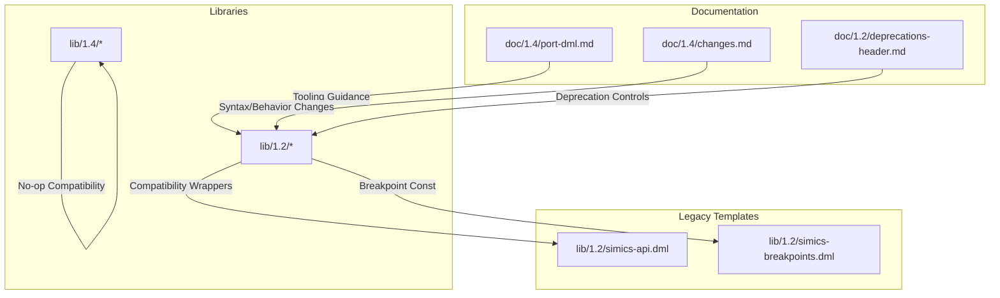
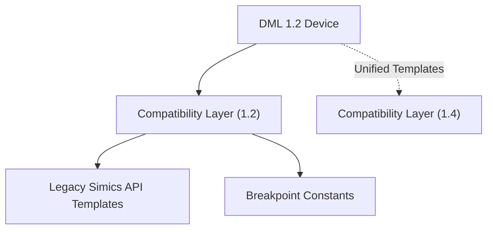
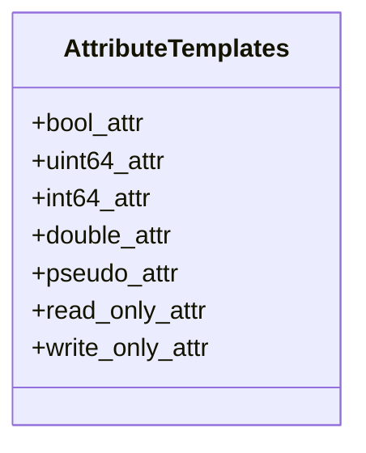
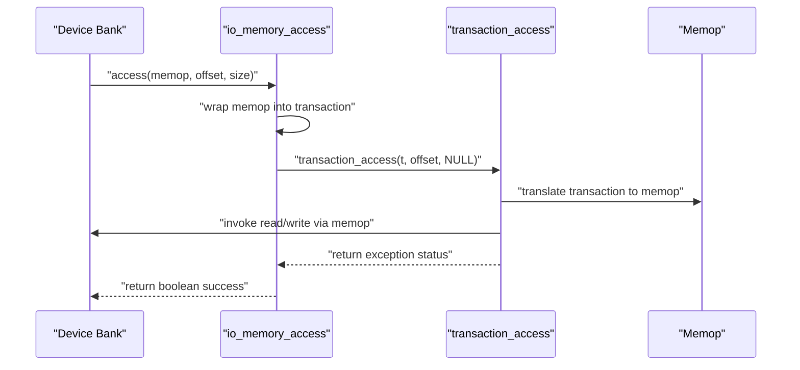
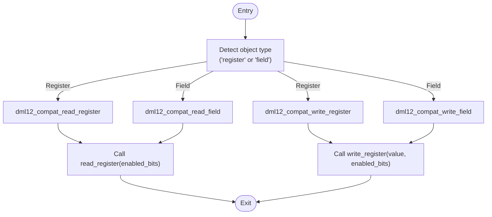
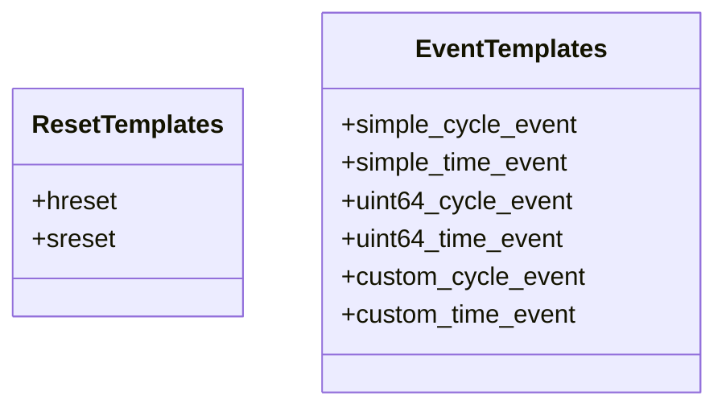
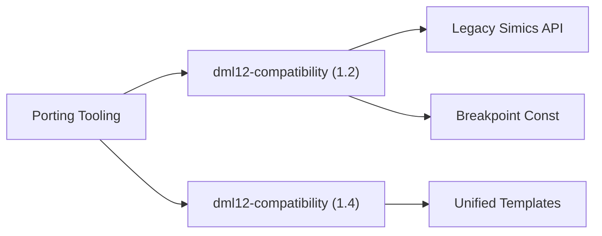

# Compatibility and Migration Templates

<cite>
**Referenced Files in This Document**
- [dml12-compatibility.dml (DML 1.2)](file://lib/1.2/dml12-compatibility.dml)
- [dml12-compatibility.dml (DML 1.4)](file://lib/1.4/dml12-compatibility.dml)
- [port-dml.md](file://doc/1.4/port-dml.md)
- [changes.md](file://doc/1.4/changes.md)
- [deprecations-header.md](file://doc/1.2/deprecations-header.md)
- [simics-api.dml](file://lib/1.2/simics-api.dml)
- [simics-breakpoints.dml](file://lib/1.2/simics-breakpoints.dml)
</cite>

## Table of Contents
1. [Introduction](#introduction)
2. [Project Structure](#project-structure)
3. [Core Components](#core-components)
4. [Architecture Overview](#architecture-overview)
5. [Detailed Component Analysis](#detailed-component-analysis)
6. [Dependency Analysis](#dependency-analysis)
7. [Performance Considerations](#performance-considerations)
8. [Troubleshooting Guide](#troubleshooting-guide)
9. [Conclusion](#conclusion)
10. [Appendices](#appendices)

## Introduction
This document explains compatibility templates and migration strategies for transitioning DML models from version 1.2 to 1.4. It focuses on:
- Legacy API templates and configuration templates
- Breakpoint handling templates
- Deprecated feature replacements
- Compatibility wrappers for memory access, register/field read/write, reset signals, and event templates
- Practical migration steps, template selection criteria, timelines, and validation/testing approaches

The goal is to help maintainers port existing DML 1.2 models to DML 1.4 with minimal disruption, leveraging compatibility templates and tooling.

## Project Structure
The repository organizes migration and compatibility assets across:
- Library templates for 1.2 and 1.4 compatibility
- Documentation describing porting procedures and language changes
- Legacy API and breakpoint/configuration templates

**Diagram sources**
- [dml12-compatibility.dml (DML 1.2)](file://lib/1.2/dml12-compatibility.dml#L1-L470)
- [dml12-compatibility.dml (DML 1.4)](file://lib/1.4/dml12-compatibility.dml#L1-L15)
- [port-dml.md](file://doc/1.4/port-dml.md#L1-L77)
- [changes.md](file://doc/1.4/changes.md#L1-L249)
- [deprecations-header.md](file://doc/1.2/deprecations-header.md#L1-L73)
- [simics-api.dml](file://lib/1.2/simics-api.dml#L1-L131)
- [simics-breakpoints.dml](file://lib/1.2/simics-breakpoints.dml#L1-L9)

**Section sources**
- [dml12-compatibility.dml (DML 1.2)](file://lib/1.2/dml12-compatibility.dml#L1-L470)
- [dml12-compatibility.dml (DML 1.4)](file://lib/1.4/dml12-compatibility.dml#L1-L15)
- [port-dml.md](file://doc/1.4/port-dml.md#L1-L77)
- [changes.md](file://doc/1.4/changes.md#L1-L249)
- [deprecations-header.md](file://doc/1.2/deprecations-header.md#L1-L73)
- [simics-api.dml](file://lib/1.2/simics-api.dml#L1-L131)
- [simics-breakpoints.dml](file://lib/1.2/simics-breakpoints.dml#L1-L9)

## Core Components
This section outlines the compatibility templates and mechanisms that enable smooth migration from DML 1.2 to 1.4.

- Attribute compatibility templates
  - Boolean, unsigned 64-bit, signed 64-bit, and double attributes with compatibility wrappers and restrictions
  - Pseudo-attributes for read-only and write-only behavior
- Memory access compatibility
  - Wrapper methods to bridge DML 1.2’s io_memory_access and transaction_access to DML 1.4-style overrides
- Register and field compatibility
  - Templates to emulate read/write behavior and integrate with DML 1.4 read_register/write_register
- Reset and event compatibility
  - Event templates for cycle/time-based events and reset signal ports
- Empty compatibility templates for DML 1.4
  - No-op placeholders to keep unified 1.4 templates compatible in 1.2 contexts

Key implementation references:
- Attribute templates and pseudo-attributes: [dml12-compatibility.dml (DML 1.2)](file://lib/1.2/dml12-compatibility.dml#L21-L64)
- Memory access wrappers: [dml12-compatibility.dml (DML 1.2)](file://lib/1.2/dml12-compatibility.dml#L66-L189)
- Register and field compatibility: [dml12-compatibility.dml (DML 1.2)](file://lib/1.2/dml12-compatibility.dml#L191-L359)
- Reset and event templates: [dml12-compatibility.dml (DML 1.2)](file://lib/1.2/dml12-compatibility.dml#L366-L427)
- DML 1.4 no-op compatibility: [dml12-compatibility.dml (DML 1.4)](file://lib/1.4/dml12-compatibility.dml#L10-L15)

**Section sources**
- [dml12-compatibility.dml (DML 1.2)](file://lib/1.2/dml12-compatibility.dml#L21-L427)
- [dml12-compatibility.dml (DML 1.4)](file://lib/1.4/dml12-compatibility.dml#L10-L15)

## Architecture Overview
The compatibility architecture bridges DML 1.2 and 1.4 by:
- Providing DML 1.2 wrappers for 1.4-style APIs
- Offering DML 1.4 no-op templates for unified codebases
- Integrating with legacy Simics API templates and breakpoint constants

**Diagram sources**
- [dml12-compatibility.dml (DML 1.2)](file://lib/1.2/dml12-compatibility.dml#L1-L470)
- [dml12-compatibility.dml (DML 1.4)](file://lib/1.4/dml12-compatibility.dml#L1-L15)
- [simics-api.dml](file://lib/1.2/simics-api.dml#L1-L131)
- [simics-breakpoints.dml](file://lib/1.2/simics-breakpoints.dml#L1-L9)

## Detailed Component Analysis

### Attribute Compatibility Templates
Purpose:
- Provide attribute templates compatible with DML 1.2 while enabling 1.4-style semantics where possible
- Ban unsupported init_val for selected attribute types in 1.2

Highlights:
- Boolean, unsigned 64-bit, signed 64-bit, and double attribute templates
- Signed 64-bit attribute override to ensure consistent return semantics
- Pseudo-attribute variants for read-only and write-only behavior

References:
- [Attribute templates and pseudo-attributes](file://lib/1.2/dml12-compatibility.dml#L21-L64)

**Diagram sources**
- [dml12-compatibility.dml (DML 1.2)](file://lib/1.2/dml12-compatibility.dml#L21-L64)

**Section sources**
- [dml12-compatibility.dml (DML 1.2)](file://lib/1.2/dml12-compatibility.dml#L21-L64)

### Memory Access Compatibility
Purpose:
- Bridge DML 1.2 io_memory_access and transaction_access to DML 1.4-style overrides
- Maintain transaction semantics across compatibility boundaries

Highlights:
- io_memory_access wrapper that constructs transactions when missing
- transaction_access wrapper that translates transactions back to memops
- Logging and error handling for oversized accesses and endian corner cases

References:
- [Memory access wrappers](file://lib/1.2/dml12-compatibility.dml#L66-L189)

**Diagram sources**
- [dml12-compatibility.dml (DML 1.2)](file://lib/1.2/dml12-compatibility.dml#L66-L189)

**Section sources**
- [dml12-compatibility.dml (DML 1.2)](file://lib/1.2/dml12-compatibility.dml#L66-L189)

### Register and Field Compatibility
Purpose:
- Emulate default read/write behavior for registers and fields
- Enable DML 1.4-style read_register/write_register overrides in 1.2

Highlights:
- read_field and write_field templates for default behavior
- dml12_compat_read_field and dml12_compat_write_field for targeted overrides
- Helper methods to construct memops for reads/writes

References:
- [Register and field compatibility](file://lib/1.2/dml12-compatibility.dml#L191-L359)

**Diagram sources**
- [dml12-compatibility.dml (DML 1.2)](file://lib/1.2/dml12-compatibility.dml#L191-L359)

**Section sources**
- [dml12-compatibility.dml (DML 1.2)](file://lib/1.2/dml12-compatibility.dml#L191-L359)

### Reset and Event Compatibility
Purpose:
- Provide reset signal ports and event templates compatible with DML 1.2
- Support cycle/time-based events with integer parameters

Highlights:
- Hard reset and soft reset signal ports
- Event templates for simple and uint64-based event info handling
- Timebase defaults for cycle and second-based events

References:
- [Reset and event templates](file://lib/1.2/dml12-compatibility.dml#L366-L427)

**Diagram sources**
- [dml12-compatibility.dml (DML 1.2)](file://lib/1.2/dml12-compatibility.dml#L366-L427)

**Section sources**
- [dml12-compatibility.dml (DML 1.2)](file://lib/1.2/dml12-compatibility.dml#L366-L427)

### DML 1.4 Compatibility Placeholders
Purpose:
- Provide empty templates in DML 1.4 to keep unified codebases compatible in 1.2 contexts

Highlights:
- No-op templates for reset, get, set, init, init_val, documentation, limitations, name, desc, shown_desc, miss_pattern_bank, function_mapped_bank, bank_obj, and others
- Ensures inheritance and parameterization remain valid across versions

References:
- [DML 1.4 compatibility placeholders](file://lib/1.4/dml12-compatibility.dml#L10-L15)

**Section sources**
- [dml12-compatibility.dml (DML 1.4)](file://lib/1.4/dml12-compatibility.dml#L10-L15)

### Legacy API and Breakpoint Templates
Purpose:
- Provide legacy Simics API declarations and breakpoint interface constants for DML 1.2
- Enable models to continue using older APIs during migration

Highlights:
- Declarations for memory allocation, vector utilities, byte order conversions, logging, and basic C library functions
- Breakpoint interface constant for compatibility

References:
- [Legacy Simics API](file://lib/1.2/simics-api.dml#L1-L131)
- [Breakpoint constants](file://lib/1.2/simics-breakpoints.dml#L1-L9)

**Section sources**
- [simics-api.dml](file://lib/1.2/simics-api.dml#L1-L131)
- [simics-breakpoints.dml](file://lib/1.2/simics-breakpoints.dml#L1-L9)

## Dependency Analysis
Compatibility templates depend on:
- DML 1.2 built-in templates and language constructs
- Legacy Simics API declarations
- Optional DML 1.4 compatibility placeholders for unified codebases

**Diagram sources**
- [dml12-compatibility.dml (DML 1.2)](file://lib/1.2/dml12-compatibility.dml#L1-L470)
- [dml12-compatibility.dml (DML 1.4)](file://lib/1.4/dml12-compatibility.dml#L1-L15)
- [simics-api.dml](file://lib/1.2/simics-api.dml#L1-L131)
- [simics-breakpoints.dml](file://lib/1.2/simics-breakpoints.dml#L1-L9)
- [port-dml.md](file://doc/1.4/port-dml.md#L1-L77)

**Section sources**
- [dml12-compatibility.dml (DML 1.2)](file://lib/1.2/dml12-compatibility.dml#L1-L470)
- [dml12-compatibility.dml (DML 1.4)](file://lib/1.4/dml12-compatibility.dml#L1-L15)
- [simics-api.dml](file://lib/1.2/simics-api.dml#L1-L131)
- [simics-breakpoints.dml](file://lib/1.2/simics-breakpoints.dml#L1-L9)
- [port-dml.md](file://doc/1.4/port-dml.md#L1-L77)

## Performance Considerations
- Transaction wrapping adds overhead for memory operations; minimize unnecessary wrapping by targeting specific banks/registers
- Logging inside compatibility wrappers aids debugging but can reduce performance under heavy traffic
- Prefer direct overrides of read_register/write_register when feasible to avoid extra translation layers

## Troubleshooting Guide
Common issues and remedies:
- Oversized memory access in transaction wrapper
  - Symptom: Error logs indicating oversized access
  - Action: Ensure access sizes align with expected limits
  - Reference: [Transaction wrapper](file://lib/1.2/dml12-compatibility.dml#L149-L152)
- Uncaught exceptions in reset signal handlers
  - Symptom: Error logs for uncaught exceptions
  - Action: Wrap reset methods with try/catch blocks
  - Reference: [Reset templates](file://lib/1.2/dml12-compatibility.dml#L366-L396)
- Endian corner cases in transaction wrapping
  - Symptom: Unimplemented warnings for inverse endian memops
  - Action: Avoid inverse endian memops or handle explicitly
  - Reference: [Endian handling](file://lib/1.2/dml12-compatibility.dml#L119-L123)
- Unused template conversions
  - Symptom: Porting script skips conversions for unused templates
  - Action: Manually port or analyze additional devices that use the code
  - Reference: [Porting guidance](file://doc/1.4/port-dml.md#L59-L64)

**Section sources**
- [dml12-compatibility.dml (DML 1.2)](file://lib/1.2/dml12-compatibility.dml#L119-L123)
- [dml12-compatibility.dml (DML 1.2)](file://lib/1.2/dml12-compatibility.dml#L366-L396)
- [dml12-compatibility.dml (DML 1.2)](file://lib/1.2/dml12-compatibility.dml#L149-L152)
- [port-dml.md](file://doc/1.4/port-dml.md#L59-L64)

## Conclusion
Compatibility templates and migration tooling provide a structured path to upgrade DML 1.2 models to 1.4. By leveraging wrappers for memory access, register/field behavior, reset signals, and events—and by using DML 1.4 no-op placeholders—teams can maintain compatibility during transition periods. Adopting the documented migration strategies, validating with testing approaches, and following the troubleshooting guidance ensures a smooth and reliable upgrade.

## Appendices

### Migration Strategies and Timeline
- Use the porting tooling to generate tag files and apply automated changes
  - Reference: [Porting tooling](file://doc/1.4/port-dml.md#L28-L77)
- Review language changes and syntax updates
  - Reference: [Changes from 1.2 to 1.4](file://doc/1.4/changes.md#L119-L249)
- Manage deprecated features with API versioning and selective disabling
  - Reference: [Deprecations header](file://doc/1.2/deprecations-header.md#L25-L73)

### Template Selection Criteria
- Choose compatibility templates that match the target behavior:
  - Memory access: Use memory access wrappers for banks requiring transaction semantics
  - Registers/Fields: Use register/field compatibility templates for targeted overrides
  - Resets/Events: Use reset and event templates for signal/event handling
  - Unified codebases: Include DML 1.4 compatibility placeholders for forward compatibility

### Testing Approaches for Compatibility Validation
- Validate memory access paths with various access sizes and alignments
- Verify register/field read/write semantics through targeted unit tests
- Confirm reset signal behavior under normal and error conditions
- Test event templates with different timebases and parameter types
- Use porting tooling feedback to identify and address conversion issues