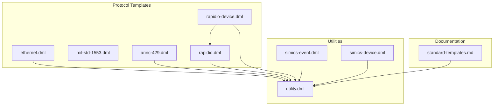
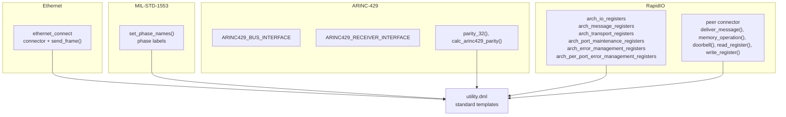
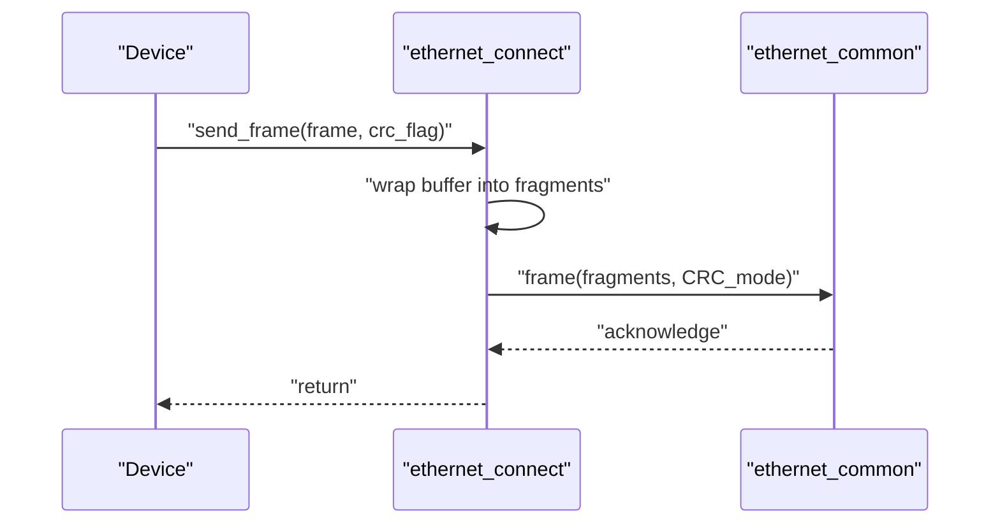
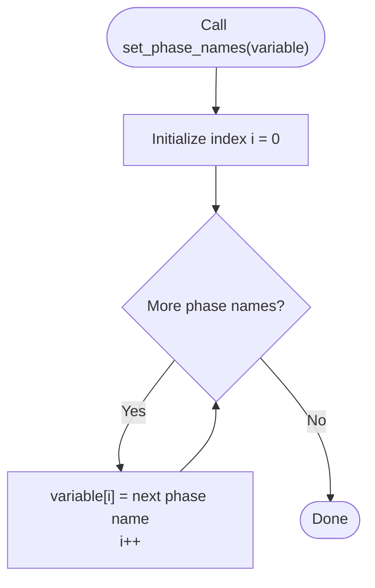
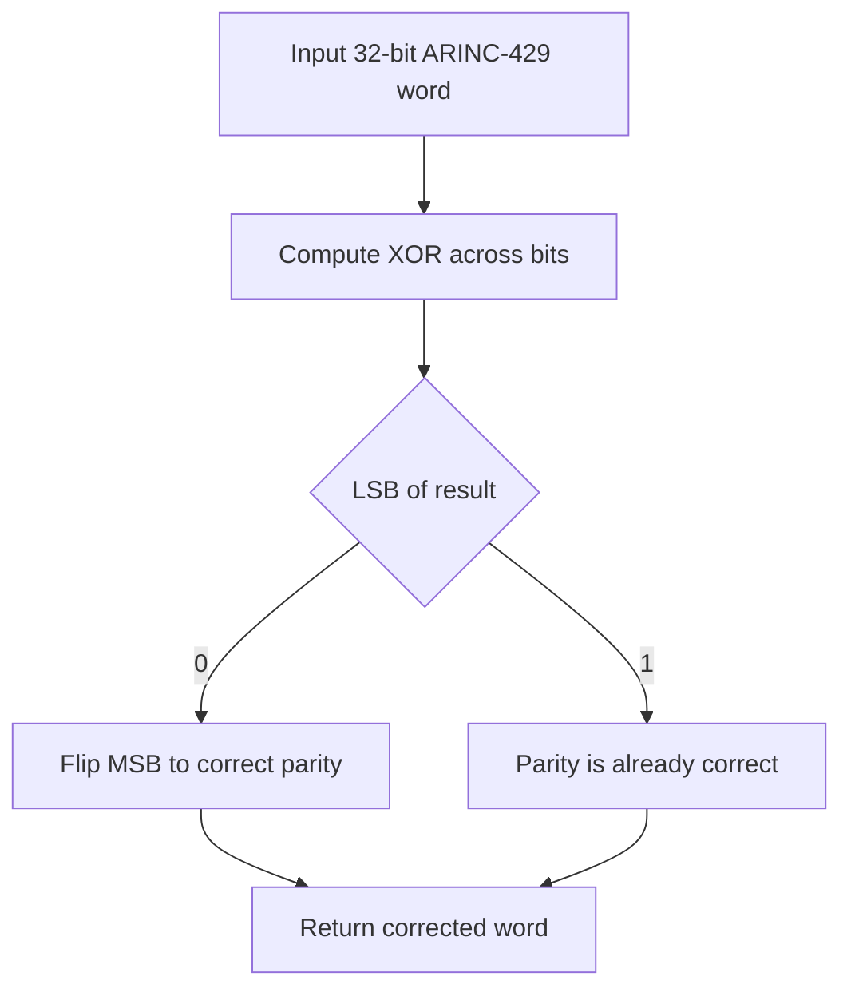
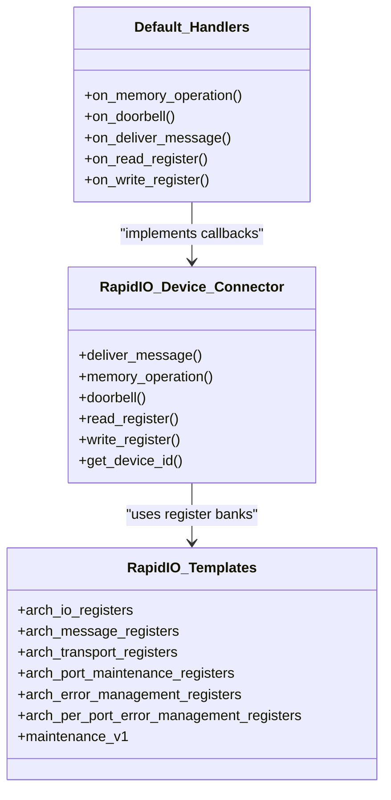
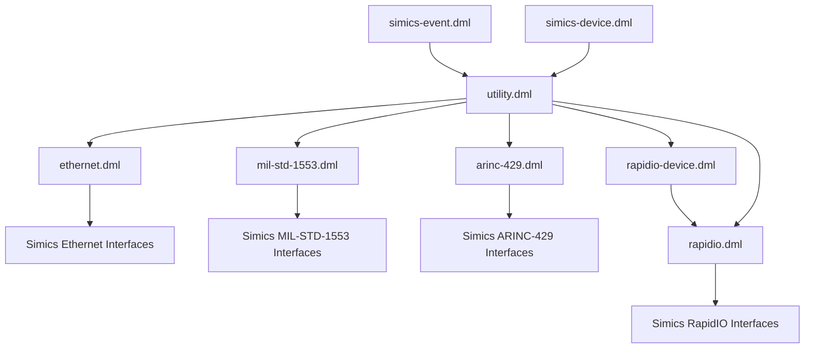

# Hardware-Specific Templates

<cite>
**Referenced Files in This Document**
- [ethernet.dml](file://lib/1.2/ethernet.dml)
- [mil-std-1553.dml](file://lib/1.2/mil-std-1553.dml)
- [arinc-429.dml](file://lib/1.2/arinc-429.dml)
- [rapidio.dml](file://lib/1.2/rapidio.dml)
- [rapidio-device.dml](file://lib/1.2/rapidio-device.dml)
- [utility.dml](file://lib/1.2/utility.dml)
- [simics-event.dml](file://lib/1.2/simics-event.dml)
- [simics-device.dml](file://lib/1.2/simics-device.dml)
- [standard-templates.md](file://doc/1.2/standard-templates.md)
</cite>

## Table of Contents
1. [Introduction](#introduction)
2. [Project Structure](#project-structure)
3. [Core Components](#core-components)
4. [Architecture Overview](#architecture-overview)
5. [Detailed Component Analysis](#detailed-component-analysis)
6. [Dependency Analysis](#dependency-analysis)
7. [Performance Considerations](#performance-considerations)
8. [Troubleshooting Guide](#troubleshooting-guide)
9. [Conclusion](#conclusion)
10. [Appendices](#appendices)

## Introduction
This document explains hardware-specific templates for common communication protocols and interfaces in the Device Modeling Language (DML). It focuses on:
- Ethernet MAC templates
- MIL-STD-1553 bus templates
- ARINC-429 avionics data bus templates
- RapidIO interconnect templates

It documents protocol-specific register layouts, timing requirements, and data format handling, and provides practical examples of implementing network interfaces, avionics systems, and high-speed interconnects. It also covers template parameters for configuration, performance tuning, and protocol variations, and shows integration patterns with standard device models and event-driven processing.

## Project Structure
The relevant templates and supporting utilities are located under lib/1.2. Protocol-specific templates are implemented as DML modules that import standard Simics device interfaces and expose convenient connectors and register banks. Utility templates define common register behaviors (e.g., read-only, write-only, reserved) that are reused across protocol templates.

**Diagram sources**
- [ethernet.dml](file://lib/1.2/ethernet.dml#L1-L48)
- [mil-std-1553.dml](file://lib/1.2/mil-std-1553.dml#L1-L27)
- [arinc-429.dml](file://lib/1.2/arinc-429.dml#L1-L33)
- [rapidio.dml](file://lib/1.2/rapidio.dml#L1-L211)
- [rapidio-device.dml](file://lib/1.2/rapidio-device.dml#L1-L181)
- [utility.dml](file://lib/1.2/utility.dml#L1-L800)
- [simics-event.dml](file://lib/1.2/simics-event.dml#L1-L10)
- [simics-device.dml](file://lib/1.2/simics-device.dml#L1-L18)
- [standard-templates.md](file://doc/1.2/standard-templates.md#L1-L608)

**Section sources**
- [ethernet.dml](file://lib/1.2/ethernet.dml#L1-L48)
- [mil-std-1553.dml](file://lib/1.2/mil-std-1553.dml#L1-L27)
- [arinc-429.dml](file://lib/1.2/arinc-429.dml#L1-L33)
- [rapidio.dml](file://lib/1.2/rapidio.dml#L1-L211)
- [rapidio-device.dml](file://lib/1.2/rapidio-device.dml#L1-L181)
- [utility.dml](file://lib/1.2/utility.dml#L1-L800)
- [simics-event.dml](file://lib/1.2/simics-event.dml#L1-L10)
- [simics-device.dml](file://lib/1.2/simics-device.dml#L1-L18)
- [standard-templates.md](file://doc/1.2/standard-templates.md#L1-L608)

## Core Components
- Ethernet MAC template: Provides a convenience connector for Ethernet links and a wrapper method to send frames via the Ethernet interface.
- MIL-STD-1553 bus template: Supplies phase names for bus phases and integrates with the MIL-STD-1553 interface.
- ARINC-429 bus template: Exposes constants for ARINC-429 interfaces and provides parity computation helpers for word integrity.
- RapidIO templates: Define register banks for capabilities, message registers, transport registers, port maintenance, and error management. They also provide a device-side connector and default handlers for RapidIO transactions and maintenance operations.

These templates integrate with standard device models and event-driven processing through Simics interfaces and logging utilities.

**Section sources**
- [ethernet.dml](file://lib/1.2/ethernet.dml#L18-L47)
- [mil-std-1553.dml](file://lib/1.2/mil-std-1553.dml#L13-L26)
- [arinc-429.dml](file://lib/1.2/arinc-429.dml#L13-L32)
- [rapidio.dml](file://lib/1.2/rapidio.dml#L40-L176)
- [rapidio-device.dml](file://lib/1.2/rapidio-device.dml#L32-L95)

## Architecture Overview
The templates follow a layered pattern:
- Protocol-specific templates import Simics device interfaces and define connectors and methods tailored to the protocol.
- Utility templates encapsulate common register behaviors (read-only, write-only, reserved, etc.) used across protocol templates.
- Event and device interface constants enable integration with Simics event loops and device abstractions.

**Diagram sources**
- [ethernet.dml](file://lib/1.2/ethernet.dml#L18-L47)
- [mil-std-1553.dml](file://lib/1.2/mil-std-1553.dml#L13-L26)
- [arinc-429.dml](file://lib/1.2/arinc-429.dml#L13-L32)
- [rapidio.dml](file://lib/1.2/rapidio.dml#L40-L176)
- [rapidio-device.dml](file://lib/1.2/rapidio-device.dml#L32-L95)
- [utility.dml](file://lib/1.2/utility.dml#L1-L800)

## Detailed Component Analysis

### Ethernet MAC Template
- Purpose: Provide a connector for direct Ethernet link connections and a convenience method to send frames while handling CRC flags.
- Key elements:
  - Connector with an Ethernet interface.
  - Method to wrap frame transmission and set CRC handling mode.
- Practical usage:
  - Declare a connector using the template and call the frame-sending method to transmit buffers to the link.

**Diagram sources**
- [ethernet.dml](file://lib/1.2/ethernet.dml#L36-L47)

**Section sources**
- [ethernet.dml](file://lib/1.2/ethernet.dml#L18-L47)

### MIL-STD-1553 Bus Template
- Purpose: Supply standardized phase names for MIL-STD-1553 bus phases and integrate with the MIL-STD-1553 interface.
- Key elements:
  - Function to populate phase names for visualization/logging.
- Practical usage:
  - Use the function to initialize state or display bus phases during simulation.

**Diagram sources**
- [mil-std-1553.dml](file://lib/1.2/mil-std-1553.dml#L13-L26)

**Section sources**
- [mil-std-1553.dml](file://lib/1.2/mil-std-1553.dml#L13-L26)

### ARINC-429 Avionics Data Bus Template
- Purpose: Expose ARINC-429 interface identifiers and provide parity computation helpers for data integrity.
- Key elements:
  - Constants for bus and receiver interfaces.
  - Parity computation and correction helpers.
- Practical usage:
  - Use the parity helpers to validate or correct ARINC-429 words before transmission or after reception.

**Diagram sources**
- [arinc-429.dml](file://lib/1.2/arinc-429.dml#L16-L32)

**Section sources**
- [arinc-429.dml](file://lib/1.2/arinc-429.dml#L13-L32)

### RapidIO Interconnect Templates
- Purpose: Define register layouts and behaviors for RapidIO v3/v4/v5 interfaces and provide a device-side connector with default handlers for transactions and maintenance.
- Key elements:
  - Capability registers (device/assembly info, PE features, switch info).
  - Message and transport registers (source/destination operations, port-write/status, component tag, routing configuration).
  - Port maintenance and per-port maintenance registers.
  - Error management and per-port error management registers.
  - Device connector with methods for message delivery, memory operations, doorbells, and maintenance register access.
  - Default handlers for incoming transactions and maintenance operations.
- Practical usage:
  - Instantiate RapidIO templates to define the device’s register bank.
  - Connect to a RapidIO peer and implement callbacks for incoming transactions.

**Diagram sources**
- [rapidio.dml](file://lib/1.2/rapidio.dml#L40-L176)
- [rapidio-device.dml](file://lib/1.2/rapidio-device.dml#L32-L181)

**Section sources**
- [rapidio.dml](file://lib/1.2/rapidio.dml#L40-L176)
- [rapidio-device.dml](file://lib/1.2/rapidio-device.dml#L32-L181)

## Dependency Analysis
- Protocol templates depend on Simics device interface modules (e.g., Ethernet, MIL-STD-1553, ARINC-429, RapidIO).
- Utility templates provide reusable register behaviors and are consumed by protocol templates.
- Event and device interface constants enable integration with Simics event loops and device abstractions.

**Diagram sources**
- [ethernet.dml](file://lib/1.2/ethernet.dml#L1-L11)
- [mil-std-1553.dml](file://lib/1.2/mil-std-1553.dml#L1-L11)
- [arinc-429.dml](file://lib/1.2/arinc-429.dml#L1-L11)
- [rapidio.dml](file://lib/1.2/rapidio.dml#L1-L11)
- [rapidio-device.dml](file://lib/1.2/rapidio-device.dml#L1-L8)
- [utility.dml](file://lib/1.2/utility.dml#L1-L800)
- [simics-event.dml](file://lib/1.2/simics-event.dml#L1-L10)
- [simics-device.dml](file://lib/1.2/simics-device.dml#L1-L18)

**Section sources**
- [ethernet.dml](file://lib/1.2/ethernet.dml#L1-L11)
- [mil-std-1553.dml](file://lib/1.2/mil-std-1553.dml#L1-L11)
- [arinc-429.dml](file://lib/1.2/arinc-429.dml#L1-L11)
- [rapidio.dml](file://lib/1.2/rapidio.dml#L1-L11)
- [rapidio-device.dml](file://lib/1.2/rapidio-device.dml#L1-L8)
- [utility.dml](file://lib/1.2/utility.dml#L1-L800)
- [simics-event.dml](file://lib/1.2/simics-event.dml#L1-L10)
- [simics-device.dml](file://lib/1.2/simics-device.dml#L1-L18)

## Performance Considerations
- Prefer using standard register templates for common behaviors (read-only, write-only, reserved) to reduce custom logic overhead.
- Minimize logging verbosity for frequently accessed registers by leveraging appropriate standard templates.
- For RapidIO, use the provided maintenance and transaction handlers to avoid redundant checks and to centralize error handling.
- Ensure CRC handling flags are set correctly when sending Ethernet frames to avoid unnecessary reprocessing.

[No sources needed since this section provides general guidance]

## Troubleshooting Guide
- Unimplemented or undocumented registers: Use standard templates to surface warnings or silence excessive logging.
- Reserved or constant fields: Apply reserved or constant templates to prevent unintended writes and to log violations appropriately.
- RapidIO maintenance register access: Use the provided maintenance handler to route register reads/writes to the correct bank.
- Event-driven processing: Integrate with Simics event interfaces to schedule periodic tasks or handle asynchronous transactions.

**Section sources**
- [standard-templates.md](file://doc/1.2/standard-templates.md#L35-L608)
- [utility.dml](file://lib/1.2/utility.dml#L365-L407)
- [rapidio-device.dml](file://lib/1.2/rapidio-device.dml#L179-L181)

## Conclusion
The hardware-specific templates provide a structured way to model Ethernet, MIL-STD-1553, ARINC-429, and RapidIO interfaces in DML. By combining protocol-specific connectors and register banks with standard device utilities and event-driven processing, developers can implement robust and maintainable device models. Proper use of template parameters and standard register behaviors ensures correctness, performance, and ease of integration.

[No sources needed since this section summarizes without analyzing specific files]

## Appendices
- Integration patterns:
  - Ethernet: Use the Ethernet connector to attach to a link and send frames with CRC handling.
  - MIL-STD-1553: Initialize bus phase names for accurate simulation state.
  - ARINC-429: Compute and correct parity to ensure data integrity.
  - RapidIO: Define register banks using the provided templates and implement callbacks for incoming transactions.

**Section sources**
- [ethernet.dml](file://lib/1.2/ethernet.dml#L18-L47)
- [mil-std-1553.dml](file://lib/1.2/mil-std-1553.dml#L13-L26)
- [arinc-429.dml](file://lib/1.2/arinc-429.dml#L16-L32)
- [rapidio.dml](file://lib/1.2/rapidio.dml#L40-L176)
- [rapidio-device.dml](file://lib/1.2/rapidio-device.dml#L32-L181)