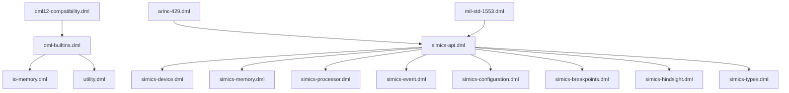
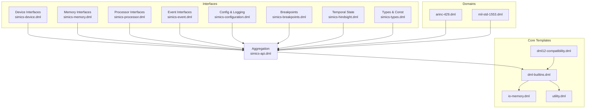
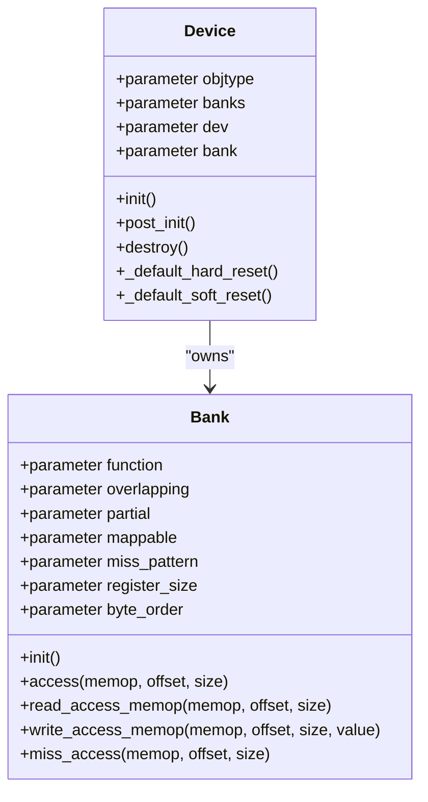
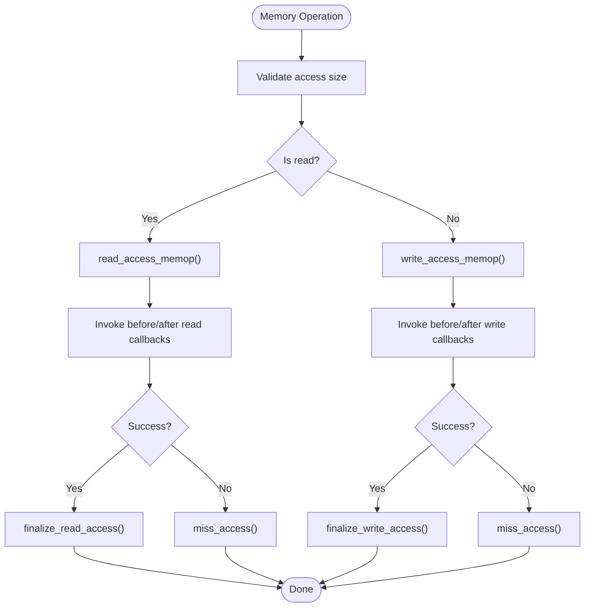
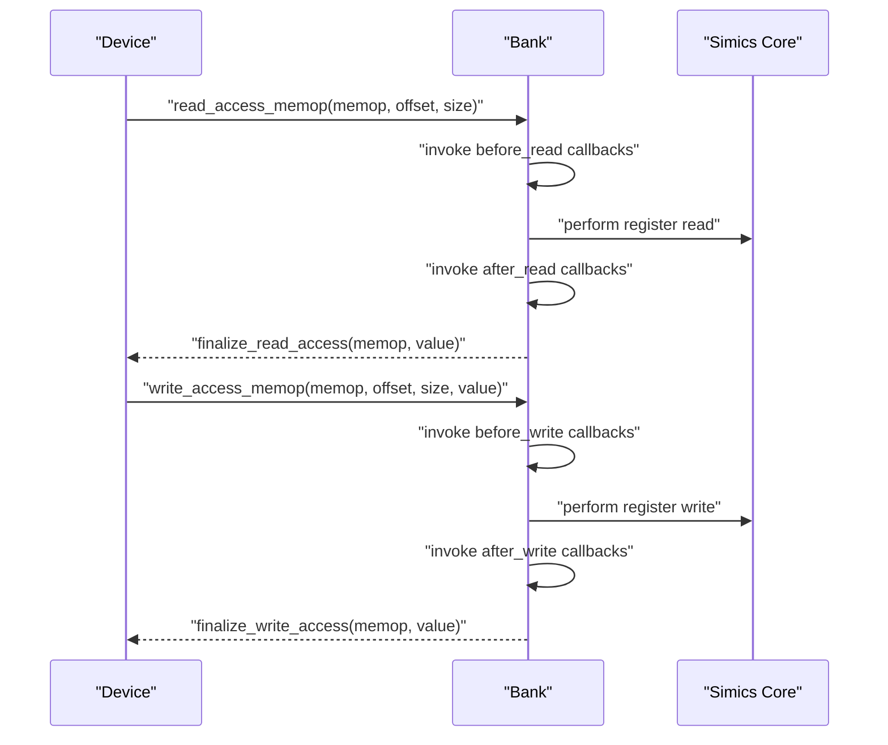
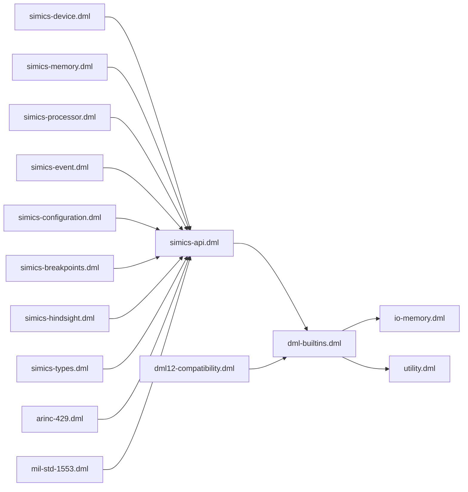

# Simics Integration Templates

<cite>
**Referenced Files in This Document**
- [simics-api.dml](file://lib/1.2/simics-api.dml)
- [simics-device.dml](file://lib/1.2/simics-device.dml)
- [simics-memory.dml](file://lib/1.2/simics-memory.dml)
- [simics-processor.dml](file://lib/1.2/simics-processor.dml)
- [simics-event.dml](file://lib/1.2/simics-event.dml)
- [simics-configuration.dml](file://lib/1.2/simics-configuration.dml)
- [simics-breakpoints.dml](file://lib/1.2/simics-breakpoints.dml)
- [simics-hindsight.dml](file://lib/1.2/simics-hindsight.dml)
- [simics-types.dml](file://lib/1.2/simics-types.dml)
- [dml-builtins.dml](file://lib/1.2/dml-builtins.dml)
- [io-memory.dml](file://lib/1.2/io-memory.dml)
- [utility.dml](file://lib/1.2/utility.dml)
- [dml12-compatibility.dml](file://lib/1.2/dml12-compatibility.dml)
- [arinc-429.dml](file://lib/1.2/arinc-429.dml)
- [mil-std-1553.dml](file://lib/1.2/mil-std-1553.dml)
</cite>

## Table of Contents
1. [Introduction](#introduction)
2. [Project Structure](#project-structure)
3. [Core Components](#core-components)
4. [Architecture Overview](#architecture-overview)
5. [Detailed Component Analysis](#detailed-component-analysis)
6. [Dependency Analysis](#dependency-analysis)
7. [Performance Considerations](#performance-considerations)
8. [Troubleshooting Guide](#troubleshooting-guide)
9. [Conclusion](#conclusion)
10. [Appendices](#appendices)

## Introduction
This document explains the Simics Integration Templates that enable seamless integration with the Intel Simics simulator environment. It focuses on:
- Device registration templates
- Memory mapping templates
- Processor interface templates
- Event system templates

It details how these templates interact with Simics APIs, handle device configuration, manage memory regions, and process simulation events. Practical guidance is provided for creating custom device types, integrating with Simics device trees, and leveraging simulator capabilities. Template parameters for device properties, performance characteristics, and simulation behavior are covered.

## Project Structure
The Simics Integration Templates are organized into modular DML libraries under lib/1.2. Each library encapsulates a domain of functionality:
- simics-api.dml: Central import hub aggregating Simics-related constants, externs, and imports for device, memory, processor, event, configuration, breakpoints, hindsight, and types.
- simics-device.dml: Device and bus interface constants used by devices and ports.
- simics-memory.dml: Memory space and translation interface constants.
- simics-processor.dml: Processor and exception interface constants.
- simics-event.dml: Event cycle and step interface constants.
- simics-configuration.dml: Configuration and logging interface constants.
- simics-breakpoints.dml: Breakpoint interface constant.
- simics-hindsight.dml: Temporal state interface constant.
- simics-types.dml: Type and constant definitions for Simics objects and exceptions.
- dml-builtins.dml: Core templates for object, device, bank, attributes, and memory access logic, plus callbacks and instrumentation hooks.
- io-memory.dml: Implements the io_memory interface for I/O memory banks.
- utility.dml: Utility templates for register/field behaviors (e.g., read-only, write-only, constant).
- dml12-compatibility.dml: Compatibility helpers bridging DML 1.2 and 1.4 behaviors for memory access and events.
- arinc-429.dml and mil-std-1553.dml: Domain-specific interface constants and helpers.

**Diagram sources**
- [simics-api.dml](file://lib/1.2/simics-api.dml#L108-L117)
- [simics-device.dml](file://lib/1.2/simics-device.dml#L8-L18)
- [simics-memory.dml](file://lib/1.2/simics-memory.dml#L13-L29)
- [simics-processor.dml](file://lib/1.2/simics-processor.dml#L8-L12)
- [simics-event.dml](file://lib/1.2/simics-event.dml#L8-L10)
- [simics-configuration.dml](file://lib/1.2/simics-configuration.dml#L8-L15)
- [simics-breakpoints.dml](file://lib/1.2/simics-breakpoints.dml#L8)
- [simics-hindsight.dml](file://lib/1.2/simics-hindsight.dml#L8)
- [simics-types.dml](file://lib/1.2/simics-types.dml#L8-L16)
- [dml-builtins.dml](file://lib/1.2/dml-builtins.dml#L18-L30)
- [io-memory.dml](file://lib/1.2/io-memory.dml#L10)
- [utility.dml](file://lib/1.2/utility.dml#L14-L19)
- [dml12-compatibility.dml](file://lib/1.2/dml12-compatibility.dml#L6-L14)
- [arinc-429.dml](file://lib/1.2/arinc-429.dml#L11)
- [mil-std-1553.dml](file://lib/1.2/mil-std-1553.dml#L11)

**Section sources**
- [simics-api.dml](file://lib/1.2/simics-api.dml#L108-L117)
- [dml-builtins.dml](file://lib/1.2/dml-builtins.dml#L18-L30)

## Core Components
This section introduces the primary building blocks used to integrate with Simics.

- Device and Port Interfaces
  - Interrupt acknowledgment and CPU interfaces
  - Port space and pin interfaces
  - Signal and multi-level signal interfaces
  - Reset and frequency/scale factor listener interfaces
  - Simple dispatcher interface

- Memory and Translation Interfaces
  - Image and linear image interfaces
  - Timing model and snoop memory interfaces
  - A20 interface
  - Memory space interface
  - RAM and ROM interfaces
  - I/O memory, translate, bridge, map/demap, cache miss interfaces

- Processor and Exception Interfaces
  - CPU group, integer register, exception, and processor info interfaces

- Event Interfaces
  - Cycle and step interfaces

- Configuration and Logging
  - Checkpoint interface
  - Log object interface
  - Minimum and maximum log levels

- Breakpoints and Hindsight
  - Breakpoint interface
  - Temporal state interface

- Types and Constants
  - Integer bounds and processor type alias
  - Pseudo-exception predicate

These components are imported and exposed via simics-api.dml, enabling device authors to compose devices using consistent interface names and behaviors.

**Section sources**
- [simics-device.dml](file://lib/1.2/simics-device.dml#L8-L18)
- [simics-memory.dml](file://lib/1.2/simics-memory.dml#L13-L29)
- [simics-processor.dml](file://lib/1.2/simics-processor.dml#L8-L12)
- [simics-event.dml](file://lib/1.2/simics-event.dml#L8-L10)
- [simics-configuration.dml](file://lib/1.2/simics-configuration.dml#L8-L15)
- [simics-breakpoints.dml](file://lib/1.2/simics-breakpoints.dml#L8)
- [simics-hindsight.dml](file://lib/1.2/simics-hindsight.dml#L8)
- [simics-types.dml](file://lib/1.2/simics-types.dml#L8-L16)
- [simics-api.dml](file://lib/1.2/simics-api.dml#L108-L117)

## Architecture Overview
The Simics Integration Templates define a layered architecture:
- Interface constants and externs are declared in dedicated libraries and aggregated in simics-api.dml.
- dml-builtins.dml provides the core templates for device, bank, attributes, and memory access, including callback registration and instrumentation hooks.
- io-memory.dml implements the io_memory interface for I/O memory banks.
- utility.dml offers reusable register/field behavior templates.
- dml12-compatibility.dml bridges DML 1.2 and 1.4 differences for memory access and events.
- Domain-specific libraries (e.g., arinc-429.dml, mil-std-1553.dml) expose domain interfaces and helpers.

**Diagram sources**
- [simics-api.dml](file://lib/1.2/simics-api.dml#L108-L117)
- [dml-builtins.dml](file://lib/1.2/dml-builtins.dml#L18-L30)
- [io-memory.dml](file://lib/1.2/io-memory.dml#L10)
- [utility.dml](file://lib/1.2/utility.dml#L14-L19)
- [dml12-compatibility.dml](file://lib/1.2/dml12-compatibility.dml#L6-L14)
- [arinc-429.dml](file://lib/1.2/arinc-429.dml#L11)
- [mil-std-1553.dml](file://lib/1.2/mil-std-1553.dml#L11)

## Detailed Component Analysis

### Device Registration Templates
Device registration is centered around the device and bank templates in dml-builtins.dml. These templates:
- Define structural parameters for devices and banks
- Provide initialization, post-initialization, and destruction hooks
- Implement hard and soft reset behaviors across banks
- Offer memory access methods (read/write) with support for overlapping and byte order
- Expose callback registration for before/after read/write and inquiry handling
- Support miss handling and logging for unmapped accesses

Key aspects:
- Device template parameters include objtype, banks, dev, bank, and log_group.
- Bank template parameters include function, overlapping, partial, mappable, miss_pattern, and register defaults (register_size, byte_order).
- Access methods route transactions through read_access_memop/write_access_memop, invoking before/after callbacks and handling inquiry modes.

**Diagram sources**
- [dml-builtins.dml](file://lib/1.2/dml-builtins.dml#L199-L270)
- [dml-builtins.dml](file://lib/1.2/dml-builtins.dml#L391-L790)

**Section sources**
- [dml-builtins.dml](file://lib/1.2/dml-builtins.dml#L199-L270)
- [dml-builtins.dml](file://lib/1.2/dml-builtins.dml#L391-L790)

### Memory Mapping Templates
Memory mapping is implemented through:
- simics-memory.dml constants for memory space, RAM/ROM, I/O memory, translate, bridge, map/demap, and cache miss interfaces
- dml-builtins.dml bank access methods supporting read/write with byte order and inquiry handling
- io-memory.dml implementing the io_memory interface for function-based I/O memory banks

Key behaviors:
- Banks route memory operations to register-level handlers or miss handlers
- Overlapping and byte-order-aware read/write logic
- Miss handling can delegate to another bank or log a specification violation

**Diagram sources**
- [dml-builtins.dml](file://lib/1.2/dml-builtins.dml#L448-L503)
- [dml-builtins.dml](file://lib/1.2/dml-builtins.dml#L622-L635)
- [dml-builtins.dml](file://lib/1.2/dml-builtins.dml#L760-L771)

**Section sources**
- [simics-memory.dml](file://lib/1.2/simics-memory.dml#L13-L29)
- [dml-builtins.dml](file://lib/1.2/dml-builtins.dml#L448-L503)
- [dml-builtins.dml](file://lib/1.2/dml-builtins.dml#L622-L635)
- [dml-builtins.dml](file://lib/1.2/dml-builtins.dml#L760-L771)
- [io-memory.dml](file://lib/1.2/io-memory.dml#L15-L49)

### Processor Interface Templates
Processor interfaces are defined in simics-processor.dml and used by processor-related templates in dml-builtins.dml and dml12-compatibility.dml:
- CPU group, integer register, exception, and processor info interfaces
- Compatibility wrappers for event handling and register/field access in DML 1.2

Integration points:
- Processor info and exception interfaces enable device interaction with processor state and exceptions
- Event templates (cycle and step) are defined in simics-event.dml and used by processor event handling

**Section sources**
- [simics-processor.dml](file://lib/1.2/simics-processor.dml#L8-L12)
- [simics-event.dml](file://lib/1.2/simics-event.dml#L8-L10)
- [dml12-compatibility.dml](file://lib/1.2/dml12-compatibility.dml#L398-L427)

### Event System Templates
Events are modeled with:
- Cycle and step interface constants in simics-event.dml
- Event templates in dml12-compatibility.dml for DML 1.2 compatibility, including simple and uint64-based event variants

Usage:
- Events can carry timebase information (cycles or seconds)
- Event info can be serialized/deserialized via get/set_event_info methods

**Diagram sources**
- [dml-builtins.dml](file://lib/1.2/dml-builtins.dml#L520-L601)
- [dml-builtins.dml](file://lib/1.2/dml-builtins.dml#L641-L708)

**Section sources**
- [simics-event.dml](file://lib/1.2/simics-event.dml#L8-L10)
- [dml12-compatibility.dml](file://lib/1.2/dml12-compatibility.dml#L398-L427)
- [dml-builtins.dml](file://lib/1.2/dml-builtins.dml#L520-L601)
- [dml-builtins.dml](file://lib/1.2/dml-builtins.dml#L641-L708)

### Attribute and Configuration Templates
Attributes and configuration are handled by:
- conf_attribute and attribute templates in dml-builtins.dml
- Configuration constants in simics-configuration.dml
- Logging and checkpoint interfaces

Highlights:
- Attributes support before_set/after_set hooks and safe get/set with error propagation
- Configuration parameters control persistence and visibility
- Log object interface enables structured logging with configurable levels

**Section sources**
- [dml-builtins.dml](file://lib/1.2/dml-builtins.dml#L286-L317)
- [dml-builtins.dml](file://lib/1.2/dml-builtins.dml#L322-L389)
- [simics-configuration.dml](file://lib/1.2/simics-configuration.dml#L8-L15)

### Utility Templates for Register/Field Behavior
utility.dml provides reusable templates for common register/field behaviors:
- Read-only, write-only, ignore-write, read-zero, constant, silent constant, zeros, ones, reserved, ignore, unimplemented, silent_unimplemented, undocumented, signed, noalloc, unmapped, sticky, and others

These templates simplify modeling of typical hardware register semantics and reduce boilerplate.

**Section sources**
- [utility.dml](file://lib/1.2/utility.dml#L27-L800)

### Domain-Specific Interfaces
Domain-specific libraries expose specialized interfaces:
- arinc-429.dml: ARINC 429 bus and receiver interfaces, plus parity helpers
- mil-std-1553.dml: MIL-STD-1553 helpers for phase names

**Section sources**
- [arinc-429.dml](file://lib/1.2/arinc-429.dml#L13-L33)
- [mil-std-1553.dml](file://lib/1.2/mil-std-1553.dml#L13-L27)

## Dependency Analysis
The Simics Integration Templates form a cohesive dependency graph:
- simics-api.dml aggregates all interface constants and imports
- dml-builtins.dml depends on simics-api.dml and provides core templates
- io-memory.dml depends on simics/devs/io-memory.dml and uses Simics externs
- utility.dml provides reusable behaviors independent of Simics specifics
- dml12-compatibility.dml depends on dml-builtins.dml and simics-api.dml to bridge 1.2/1.4 differences
- Domain libraries depend on simics-api.dml and domain-specific device models

**Diagram sources**
- [simics-api.dml](file://lib/1.2/simics-api.dml#L108-L117)
- [dml-builtins.dml](file://lib/1.2/dml-builtins.dml#L18-L30)
- [io-memory.dml](file://lib/1.2/io-memory.dml#L10)
- [utility.dml](file://lib/1.2/utility.dml#L14-L19)
- [dml12-compatibility.dml](file://lib/1.2/dml12-compatibility.dml#L6-L14)
- [arinc-429.dml](file://lib/1.2/arinc-429.dml#L11)
- [mil-std-1553.dml](file://lib/1.2/mil-std-1553.dml#L11)

**Section sources**
- [simics-api.dml](file://lib/1.2/simics-api.dml#L108-L117)
- [dml-builtins.dml](file://lib/1.2/dml-builtins.dml#L18-L30)
- [io-memory.dml](file://lib/1.2/io-memory.dml#L10)
- [utility.dml](file://lib/1.2/utility.dml#L14-L19)
- [dml12-compatibility.dml](file://lib/1.2/dml12-compatibility.dml#L6-L14)

## Performance Considerations
- Byte-order and overlapping access handling in bank templates can impact performance; choose appropriate parameters (e.g., byte_order, overlapping) to minimize callback overhead.
- Use miss_pattern and miss_bank to optimize fallback handling for unmapped regions.
- Prefer efficient register/field templates (e.g., read_zero, ignore_write) to reduce unnecessary logging and computation.
- Leverage before/after callbacks judiciously; excessive callback invocation can degrade simulation speed.
- For I/O memory, ensure function-based routing avoids unnecessary exception handling by aligning bank functions with device mappings.

[No sources needed since this section provides general guidance]

## Troubleshooting Guide
Common issues and resolutions:
- Oversized access: Banks validate access size and throw on oversized operations; ensure register sizes and access patterns conform to 1–8 bytes.
- Unmapped access: If miss_pattern is not set, miss_access logs and throws; configure miss_bank or miss_pattern appropriately.
- Byte order errors: Ensure byte_order parameter is set consistently; otherwise, read/write methods will error.
- Callback failures: Use before/after callback suppression and inquiry modes carefully; verify initiator and offset handling.
- Logging: Use log object interface and configurable log levels to diagnose issues without flooding logs.

**Section sources**
- [dml-builtins.dml](file://lib/1.2/dml-builtins.dml#L450-L453)
- [dml-builtins.dml](file://lib/1.2/dml-builtins.dml#L760-L771)
- [dml-builtins.dml](file://lib/1.2/dml-builtins.dml#L464-L472)
- [dml-builtins.dml](file://lib/1.2/dml-builtins.dml#L526-L538)
- [simics-configuration.dml](file://lib/1.2/simics-configuration.dml#L10-L15)

## Conclusion
The Simics Integration Templates provide a robust foundation for building devices that integrate seamlessly with Intel Simics. By leveraging device and bank templates, memory mapping logic, processor interfaces, and event systems, developers can create accurate, configurable, and high-performance device models. The templates’ emphasis on callbacks, logging, and compatibility ensures reliable simulation behavior across diverse environments.

[No sources needed since this section summarizes without analyzing specific files]

## Appendices

### Creating Custom Device Types
Steps to create a custom device:
- Define a device using the device template in dml-builtins.dml
- Add banks with appropriate parameters (function, overlapping, byte_order)
- Implement register/field behaviors using templates from utility.dml
- Integrate I/O memory using io-memory.dml if applicable
- Configure attributes and logging via conf_attribute and attribute templates
- Use simics-api.dml to import required interfaces

**Section sources**
- [dml-builtins.dml](file://lib/1.2/dml-builtins.dml#L199-L270)
- [dml-builtins.dml](file://lib/1.2/dml-builtins.dml#L391-L790)
- [io-memory.dml](file://lib/1.2/io-memory.dml#L15-L49)
- [utility.dml](file://lib/1.2/utility.dml#L27-L800)
- [simics-api.dml](file://lib/1.2/simics-api.dml#L108-L117)

### Integrating with Simics Device Trees
- Use bank templates to expose registers and fields in the device tree
- Employ function-mapped banks for I/O memory routing
- Utilize miss_bank to delegate unmapped accesses to specialized handlers
- Apply checkpoint and log object interfaces for runtime introspection

**Section sources**
- [dml-builtins.dml](file://lib/1.2/dml-builtins.dml#L413-L427)
- [dml-builtins.dml](file://lib/1.2/dml-builtins.dml#L765-L771)
- [simics-configuration.dml](file://lib/1.2/simics-configuration.dml#L8-L15)

### Leveraging Simulator Capabilities
- Use processor interfaces to interact with CPU state and exceptions
- Employ event templates for cycle- and time-based scheduling
- Utilize breakpoint and temporal state interfaces for advanced debugging and state capture
- Apply endian conversion and vector utilities for efficient data handling

**Section sources**
- [simics-processor.dml](file://lib/1.2/simics-processor.dml#L8-L12)
- [simics-event.dml](file://lib/1.2/simics-event.dml#L8-L10)
- [simics-breakpoints.dml](file://lib/1.2/simics-breakpoints.dml#L8)
- [simics-hindsight.dml](file://lib/1.2/simics-hindsight.dml#L8)
- [simics-api.dml](file://lib/1.2/simics-api.dml#L14-L131)