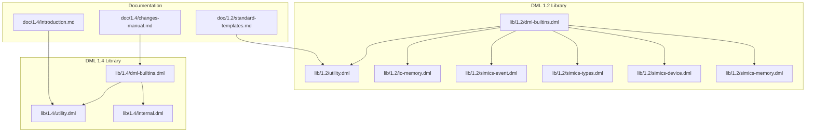
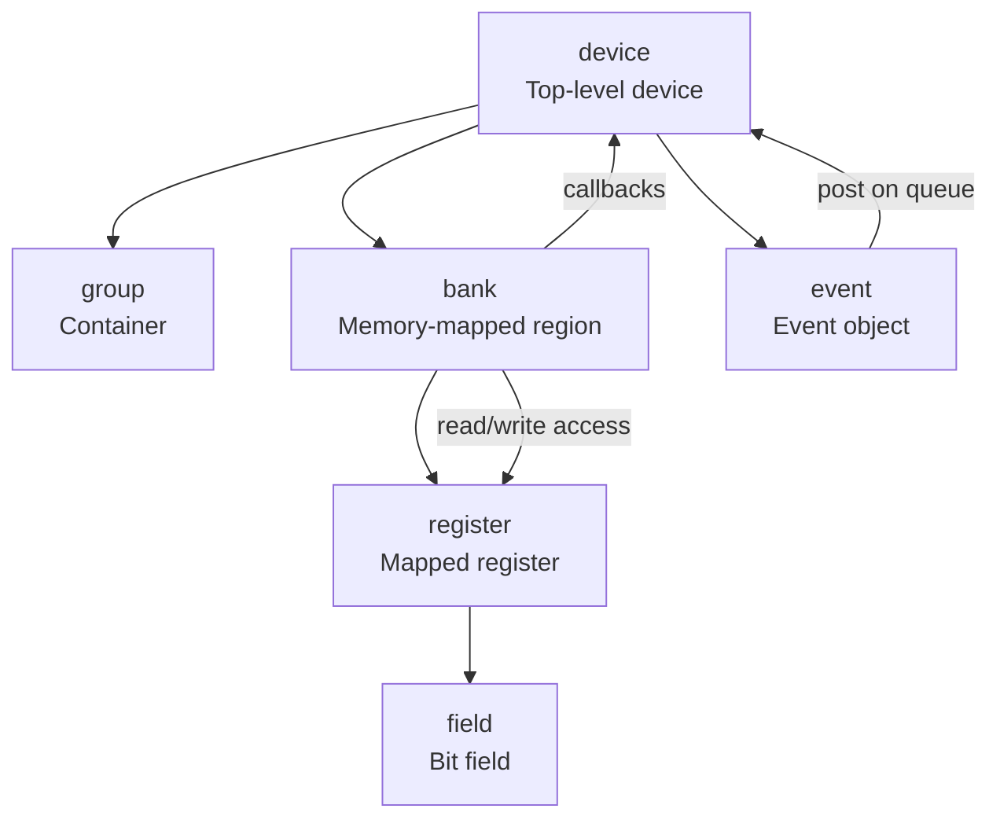
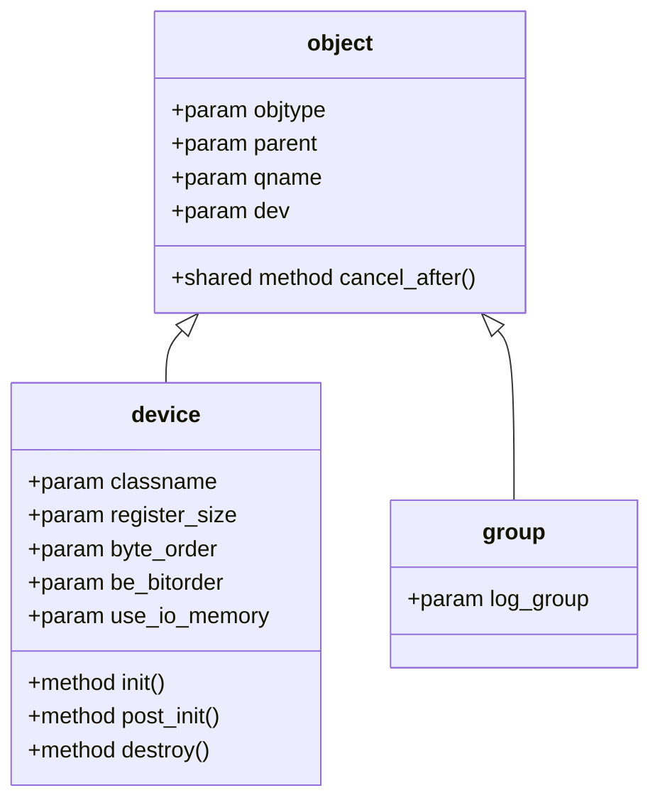
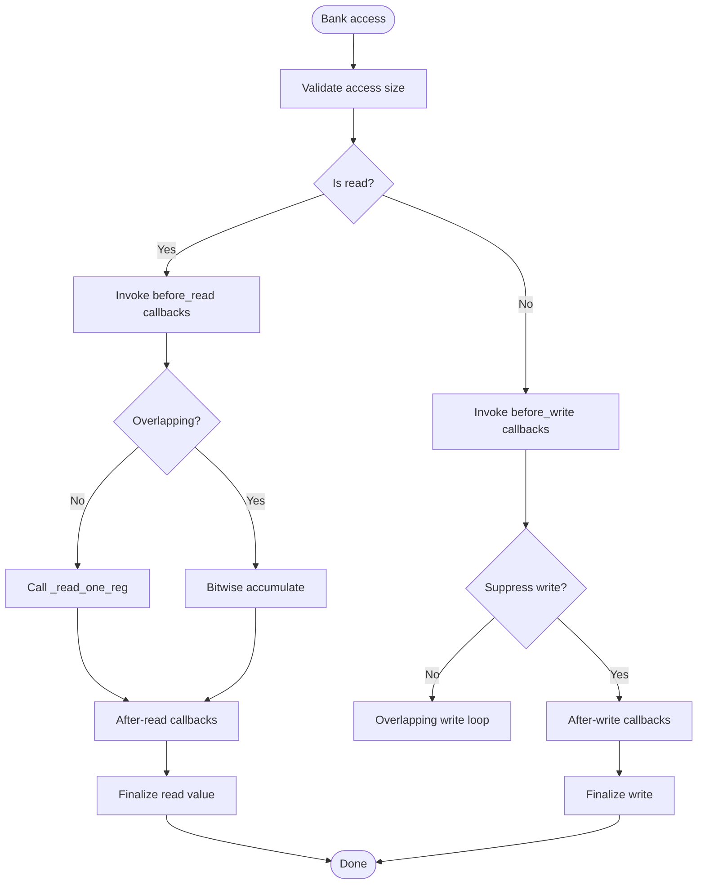
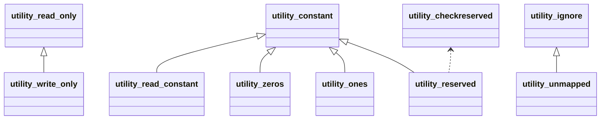
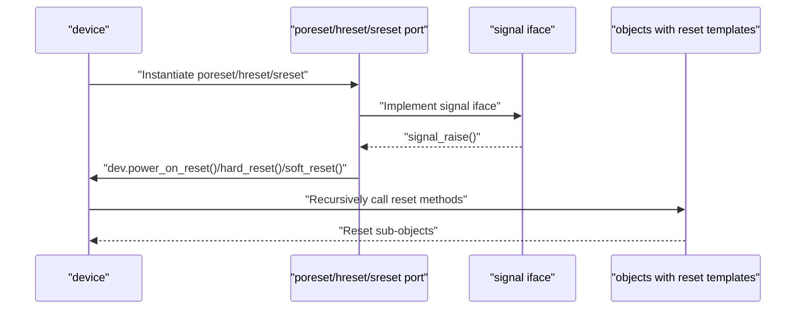
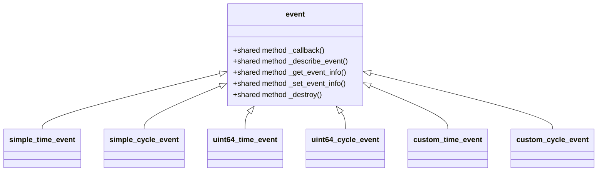
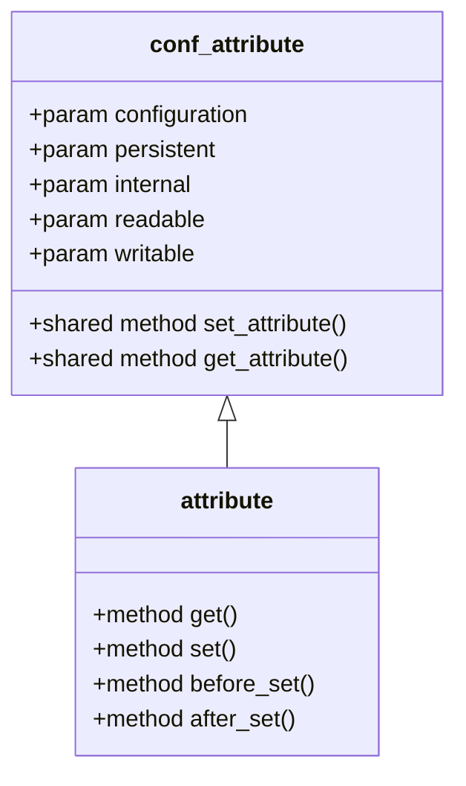
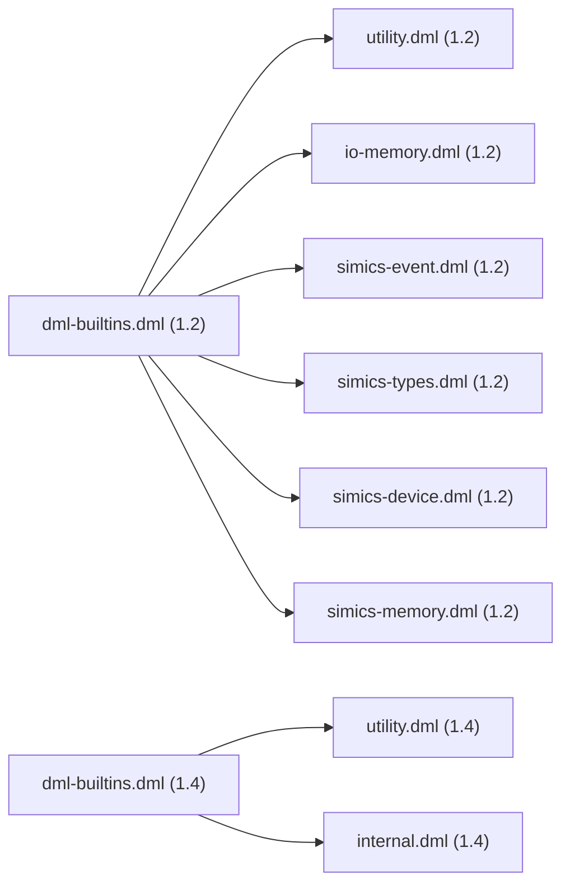

# Standard Built-in Templates

<cite>
**Referenced Files in This Document**
- [dml-builtins.dml (DML 1.2)](file://lib/1.2/dml-builtins.dml)
- [utility.dml (DML 1.2)](file://lib/1.2/utility.dml)
- [io-memory.dml (DML 1.2)](file://lib/1.2/io-memory.dml)
- [simics-event.dml (DML 1.2)](file://lib/1.2/simics-event.dml)
- [simics-types.dml (DML 1.2)](file://lib/1.2/simics-types.dml)
- [simics-device.dml (DML 1.2)](file://lib/1.2/simics-device.dml)
- [simics-memory.dml (DML 1.2)](file://lib/1.2/simics-memory.dml)
- [dml-builtins.dml (DML 1.4)](file://lib/1.4/dml-builtins.dml)
- [utility.dml (DML 1.4)](file://lib/1.4/utility.dml)
- [internal.dml (DML 1.4)](file://lib/1.4/internal.dml)
- [standard-templates.md (DML 1.2 docs)](file://doc/1.2/standard-templates.md)
- [introduction.md (DML 1.4 docs)](file://doc/1.4/introduction.md)
- [changes-manual.md (DML 1.4 docs)](file://doc/1.4/changes-manual.md)
</cite>

## Table of Contents
1. [Introduction](#introduction)
2. [Project Structure](#project-structure)
3. [Core Components](#core-components)
4. [Architecture Overview](#architecture-overview)
5. [Detailed Component Analysis](#detailed-component-analysis)
6. [Dependency Analysis](#dependency-analysis)
7. [Performance Considerations](#performance-considerations)
8. [Troubleshooting Guide](#troubleshooting-guide)
9. [Conclusion](#conclusion)
10. [Appendices](#appendices)

## Introduction
This document explains the standard built-in templates that form the foundation of device modeling in DML. It covers:
- Basic device structures (device, group, object)
- Memory-mapped register banks (bank) and register/field behavior
- Event handling mechanisms (events and time/cycle-based triggers)
- Fundamental data types and attributes
- Template syntax, parameter definitions, and instantiation patterns
- Composition and inheritance techniques
- How built-in templates relate to generated C code structure

It targets both newcomers and experienced modelers who need a practical guide to DML’s reusable building blocks and their runtime behavior.

## Project Structure
The built-in templates are defined in library files per DML version. The 1.2 library provides the original template set and extensive utility templates for registers and fields. The 1.4 library introduces a redesigned reset API, event templates, and refined attribute handling.

**Diagram sources**
- [dml-builtins.dml (DML 1.2)](file://lib/1.2/dml-builtins.dml#L1-L2074)
- [utility.dml (DML 1.2)](file://lib/1.2/utility.dml#L1-L894)
- [io-memory.dml (DML 1.2)](file://lib/1.2/io-memory.dml#L1-L50)
- [simics-event.dml (DML 1.2)](file://lib/1.2/simics-event.dml#L1-L10)
- [simics-types.dml (DML 1.2)](file://lib/1.2/simics-types.dml#L1-L16)
- [simics-device.dml (DML 1.2)](file://lib/1.2/simics-device.dml#L1-L18)
- [simics-memory.dml (DML 1.2)](file://lib/1.2/simics-memory.dml#L1-L29)
- [dml-builtins.dml (DML 1.4)](file://lib/1.4/dml-builtins.dml#L1-L4128)
- [utility.dml (DML 1.4)](file://lib/1.4/utility.dml#L1-L1490)
- [internal.dml (DML 1.4)](file://lib/1.4/internal.dml#L1-L94)
- [standard-templates.md (DML 1.2 docs)](file://doc/1.2/standard-templates.md#L1-L608)
- [introduction.md (DML 1.4 docs)](file://doc/1.4/introduction.md#L288-L325)
- [changes-manual.md (DML 1.4 docs)](file://doc/1.4/changes-manual.md#L96-L411)

**Section sources**
- [dml-builtins.dml (DML 1.2)](file://lib/1.2/dml-builtins.dml#L1-L2074)
- [dml-builtins.dml (DML 1.4)](file://lib/1.4/dml-builtins.dml#L1-L4128)

## Core Components
This section summarizes the core template families and their roles.

- Object model
  - object: Base template for all objects; provides identity, naming, documentation, and lifecycle helpers.
  - device: Top-level device object; orchestrates initialization, post-initialization, and destruction.
  - group: Container for organizing objects; enforces namespace rules.

- Banks and registers
  - bank: Memory-mapped region with read/write access, callbacks, and miss handling.
  - register/field: Storage and behavior for individual memory locations; behavior governed by utility templates.

- Attributes and configuration
  - attribute: Typed configuration attributes backed by Simics attribute system.
  - conf_attribute/_conf_attribute: Shared attribute registration and flags.

- Events
  - event: Event object with templated time/cycle semantics and data variants.
  - time/cycle-based event templates: simple, uint64, custom variants.

- Utilities (DML 1.2)
  - Reset and register behavior templates (read_only, write_only, constant, reserved, etc.).
  - Bit-field and access control helpers.

- Utilities (DML 1.4)
  - Reset templates: poreset, hreset, sreset and their underlying power_on_reset, hard_reset, soft_reset.
  - Field-level read/write templates: read_only, write_only, read_constant, constant, reserved, ignore_write, etc.

**Section sources**
- [dml-builtins.dml (DML 1.2)](file://lib/1.2/dml-builtins.dml#L164-L270)
- [dml-builtins.dml (DML 1.2)](file://lib/1.2/dml-builtins.dml#L391-L800)
- [dml-builtins.dml (DML 1.4)](file://lib/1.4/dml-builtins.dml#L525-L670)
- [dml-builtins.dml (DML 1.4)](file://lib/1.4/dml-builtins.dml#L3767-L3870)
- [utility.dml (DML 1.2)](file://lib/1.2/utility.dml#L1-L894)
- [utility.dml (DML 1.4)](file://lib/1.4/utility.dml#L170-L333)

## Architecture Overview
The built-in templates define the object model, memory access semantics, and event system. Devices are composed of groups and banks, which contain registers and fields. Accesses traverse the bank’s read/write pipeline, invoking callbacks and template-provided behaviors. Events are posted on queues and dispatched according to time or cycle semantics.

**Diagram sources**
- [dml-builtins.dml (DML 1.2)](file://lib/1.2/dml-builtins.dml#L199-L270)
- [dml-builtins.dml (DML 1.2)](file://lib/1.2/dml-builtins.dml#L391-L484)
- [dml-builtins.dml (DML 1.4)](file://lib/1.4/dml-builtins.dml#L525-L670)
- [dml-builtins.dml (DML 1.4)](file://lib/1.4/dml-builtins.dml#L3767-L3870)

## Detailed Component Analysis

### Object Model: object, device, group
- object
  - Provides identity, naming, documentation, and a cancel_after helper for event cancellation scoped to the object.
  - Includes qname computation and parent traversal.
- device
  - Adds init/post_init/destroy orchestration and device-wide parameters (classname, register_size, byte_order, be_bitorder, use_io_memory).
  - Implements _init/_post_init/_destroy to recursively call into the object graph.
- group
  - Lightweight container with namespace checks to avoid conflicts with special names.

**Diagram sources**
- [dml-builtins.dml (DML 1.2)](file://lib/1.2/dml-builtins.dml#L164-L188)
- [dml-builtins.dml (DML 1.2)](file://lib/1.2/dml-builtins.dml#L199-L270)
- [dml-builtins.dml (DML 1.2)](file://lib/1.2/dml-builtins.dml#L190-L197)

**Section sources**
- [dml-builtins.dml (DML 1.2)](file://lib/1.2/dml-builtins.dml#L164-L270)

### Bank and Memory Access: bank
- Responsibilities
  - Define register mapping, byte order, and overlapping/partial access behavior.
  - Provide read/write access methods that route to register implementations and invoke before/after callbacks.
  - Miss handling via miss_access and miss patterns for unmapped regions.
- Key methods
  - access/read_access/write_access and their memop variants.
  - get_write_value/set_read_value for endian-aware value handling.
  - _read_one_reg/_write_one_reg (compiler-intercepted).
- Callbacks
  - _register_before_read/_after_read/_before_write/_after_write.
  - _callback_before_read/_after_read/_before_write/_after_write.

**Diagram sources**
- [dml-builtins.dml (DML 1.2)](file://lib/1.2/dml-builtins.dml#L448-L601)
- [dml-builtins.dml (DML 1.2)](file://lib/1.2/dml-builtins.dml#L641-L708)

**Section sources**
- [dml-builtins.dml (DML 1.2)](file://lib/1.2/dml-builtins.dml#L391-L800)

### Register and Field Behavior: utility templates (DML 1.2)
Common behaviors are expressed via templates applied to registers and fields. Examples include read-only, write-only, constant, reserved, and unimplemented behaviors. These templates override read/write methods and log warnings or enforce constraints.

Key templates (selection):
- read_only, write_only, read_zero, ignore_write
- constant, read_constant, silent_constant, zeros, ones
- reserved, ignore, unmapped, sticky, no_reset
- checkreserved, undocumented, design_limitation

**Diagram sources**
- [utility.dml (DML 1.2)](file://lib/1.2/utility.dml#L114-L191)
- [utility.dml (DML 1.2)](file://lib/1.2/utility.dml#L365-L407)
- [utility.dml (DML 1.2)](file://lib/1.2/utility.dml#L301-L318)
- [utility.dml (DML 1.2)](file://lib/1.2/utility.dml#L493-L505)
- [utility.dml (DML 1.2)](file://lib/1.2/utility.dml#L465-L476)
- [utility.dml (DML 1.2)](file://lib/1.2/utility.dml#L785-L787)
- [utility.dml (DML 1.2)](file://lib/1.2/utility.dml#L820-L835)

**Section sources**
- [utility.dml (DML 1.2)](file://lib/1.2/utility.dml#L1-L894)
- [standard-templates.md (DML 1.2 docs)](file://doc/1.2/standard-templates.md#L1-L608)

### Reset Mechanisms: poreset, hreset, sreset (DML 1.4)
DML 1.4 introduces explicit reset ports and templates:
- power_on_reset, hard_reset, soft_reset: base templates with recursive default behavior.
- poreset, hreset, sreset: instantiate ports POWER/HRESET/SRESET and wire them to device reset methods.
- soft_reset_val: override soft reset to a specific value.

**Diagram sources**
- [utility.dml (DML 1.4)](file://lib/1.4/utility.dml#L176-L190)
- [utility.dml (DML 1.4)](file://lib/1.4/utility.dml#L201-L215)
- [utility.dml (DML 1.4)](file://lib/1.4/utility.dml#L241-L255)
- [utility.dml (DML 1.4)](file://lib/1.4/utility.dml#L319-L333)
- [utility.dml (DML 1.4)](file://lib/1.4/utility.dml#L363-L369)

**Section sources**
- [utility.dml (DML 1.4)](file://lib/1.4/utility.dml#L170-L333)
- [changes-manual.md (DML 1.4 docs)](file://doc/1.4/changes-manual.md#L96-L126)

### Event Handling: event templates (DML 1.4)
Events are modeled as objects with templated posting semantics:
- simple_time_event, simple_cycle_event
- uint64_time_event, uint64_cycle_event
- custom_time_event, custom_cycle_event

Each template defines:
- event(): abstract callback method
- post(): non-overrideable posting method
- Additional methods per variant (e.g., next/posted/remove for uint64 variants; set_event_info/get_event_info/destroy for custom variants)

**Diagram sources**
- [dml-builtins.dml (DML 1.4)](file://lib/1.4/dml-builtins.dml#L3767-L3870)
- [changes-manual.md (DML 1.4 docs)](file://doc/1.4/changes-manual.md#L127-L222)

**Section sources**
- [dml-builtins.dml (DML 1.4)](file://lib/1.4/dml-builtins.dml#L3767-L3870)
- [changes-manual.md (DML 1.4 docs)](file://doc/1.4/changes-manual.md#L127-L222)

### Attributes and Configuration
- DML 1.2
  - attribute: Typed configuration attribute with get/set and before_set/after_set hooks.
  - conf_attribute/_conf_attribute: Shared attribute registration flags and metadata.
- DML 1.4
  - Attribute templates (e.g., uint64_attr, int64_attr, bool_attr, double_attr) replace allocate_type.
  - Attributes now use readable/writable flags and typed registration.

**Diagram sources**
- [dml-builtins.dml (DML 1.2)](file://lib/1.2/dml-builtins.dml#L286-L317)
- [dml-builtins.dml (DML 1.2)](file://lib/1.2/dml-builtins.dml#L322-L389)
- [dml-builtins.dml (DML 1.4)](file://lib/1.4/dml-builtins.dml#L713-L792)

**Section sources**
- [dml-builtins.dml (DML 1.2)](file://lib/1.2/dml-builtins.dml#L286-L389)
- [dml-builtins.dml (DML 1.4)](file://lib/1.4/dml-builtins.dml#L713-L792)

### Template Syntax, Parameters, and Instantiation
- Templates are instantiated using the is statement within object or template declarations.
- Parameters can be required or defaulted; they may be overridden by later declarations.
- Inheritance: templates can extend other templates to refine behavior.

Example patterns:
- Single template: is templateName
- Multiple templates: is (templateA, templateB)
- Inline instantiation: bank regs is (templateA, templateB) { register reg @ 0; }

**Section sources**
- [introduction.md (DML 1.4 docs)](file://doc/1.4/introduction.md#L288-L325)

### Common Device Modeling Scenarios

#### Simple I/O device
- Compose a device with groups and banks.
- Attach registers and fields with appropriate behavior templates (e.g., read_only, write_only, constant).
- Expose configuration attributes via attribute templates.

**Section sources**
- [dml-builtins.dml (DML 1.2)](file://lib/1.2/dml-builtins.dml#L199-L270)
- [utility.dml (DML 1.2)](file://lib/1.2/utility.dml#L114-L191)

#### Register banks with bit fields
- Define registers with fields and apply field-level templates (read_only, reserved, ignore_write).
- Use checkreserved to enforce reserved bit semantics.

**Section sources**
- [utility.dml (DML 1.2)](file://lib/1.2/utility.dml#L820-L835)

#### Interrupt controller
- Use signal interfaces (e.g., interrupt_ack, interrupt_cpu) to model interrupt signaling.
- Post events to schedule interrupt acknowledgments or CPU notifications.

**Section sources**
- [simics-device.dml (DML 1.2)](file://lib/1.2/simics-device.dml#L8-L17)
- [dml-builtins.dml (DML 1.4)](file://lib/1.4/dml-builtins.dml#L3767-L3870)

#### Memory interfaces
- Implement io_memory to route memory transactions to banks.
- Use bank miss handling for unmapped regions.

**Section sources**
- [io-memory.dml (DML 1.2)](file://lib/1.2/io-memory.dml#L15-L49)
- [dml-builtins.dml (DML 1.2)](file://lib/1.2/dml-builtins.dml#L759-L790)

## Dependency Analysis
Built-in templates depend on each other and on external interfaces. The 1.2 library centralizes object model, bank access, and utilities. The 1.4 library refactors reset and event APIs and introduces typed attribute templates.

**Diagram sources**
- [dml-builtins.dml (DML 1.2)](file://lib/1.2/dml-builtins.dml#L1-L30)
- [dml-builtins.dml (DML 1.4)](file://lib/1.4/dml-builtins.dml#L1-L30)
- [utility.dml (DML 1.2)](file://lib/1.2/utility.dml#L1-L10)
- [io-memory.dml (DML 1.2)](file://lib/1.2/io-memory.dml#L1-L10)
- [simics-event.dml (DML 1.2)](file://lib/1.2/simics-event.dml#L1-L10)
- [simics-types.dml (DML 1.2)](file://lib/1.2/simics-types.dml#L1-L16)
- [simics-device.dml (DML 1.2)](file://lib/1.2/simics-device.dml#L1-L18)
- [simics-memory.dml (DML 1.2)](file://lib/1.2/simics-memory.dml#L1-L29)
- [utility.dml (DML 1.4)](file://lib/1.4/utility.dml#L1-L13)
- [internal.dml (DML 1.4)](file://lib/1.4/internal.dml#L1-L94)

**Section sources**
- [dml-builtins.dml (DML 1.2)](file://lib/1.2/dml-builtins.dml#L1-L30)
- [dml-builtins.dml (DML 1.4)](file://lib/1.4/dml-builtins.dml#L1-L30)

## Performance Considerations
- Bank access paths
  - Overlapping/partial access increases complexity; prefer non-overlapping layouts for performance.
  - Byte order selection impacts value packing/unpacking costs.
- Callback overhead
  - Minimize heavy logic in before/after callbacks; cache frequently accessed data.
- Event posting
  - Prefer uint64/custom variants only when needed; simple variants reduce serialization overhead.
- Attribute registration
  - Use readable/writable flags to avoid unnecessary attribute exposure.

[No sources needed since this section provides general guidance]

## Troubleshooting Guide
- Oversized access
  - Bank access validates size; exceeding limits triggers errors. Ensure access sizes match register widths.
- Miss handling
  - Unmapped accesses invoke miss_access; configure miss_bank or log_miss appropriately.
- Reserved bit violations
  - Use checkreserved to detect writes to reserved bits and log spec violations.
- Reset behavior
  - In DML 1.4, reset methods are opt-in via poreset/hreset/sreset templates. Verify ports and wiring.
- Event misuse
  - Ensure the correct event template is instantiated; mismatched data types cause compilation errors.

**Section sources**
- [dml-builtins.dml (DML 1.2)](file://lib/1.2/dml-builtins.dml#L450-L453)
- [dml-builtins.dml (DML 1.2)](file://lib/1.2/dml-builtins.dml#L759-L790)
- [utility.dml (DML 1.2)](file://lib/1.2/utility.dml#L820-L835)
- [utility.dml (DML 1.4)](file://lib/1.4/utility.dml#L176-L190)

## Conclusion
DML’s built-in templates provide a robust, composable foundation for device modeling:
- The object model (object/device/group) establishes structure and lifecycle.
- Banks encapsulate memory-mapped access with flexible callbacks and miss handling.
- Utility templates in DML 1.2 and 1.4 define register/field behaviors and reset/event semantics.
- Proper composition and parameterization enable realistic, maintainable device models.

[No sources needed since this section summarizes without analyzing specific files]

## Appendices

### Template Instantiation Patterns
- Single template: is templateName
- Multiple templates: is (templateA, templateB)
- Inline instantiation: bank regs is (templateA, templateB) { register reg @ 0; }

**Section sources**
- [introduction.md (DML 1.4 docs)](file://doc/1.4/introduction.md#L288-L325)

### Relationship Between Built-in Templates and Generated C Code
- Templates are compiled into C structures and methods; object identity and qname are materialized in generated code.
- Bank access methods and callbacks translate to C function calls with typed parameters.
- Event templates generate dispatch routines and serialization logic based on chosen variant.
- Attributes are registered with Simics using flags derived from template parameters.

**Section sources**
- [dml-builtins.dml (DML 1.2)](file://lib/1.2/dml-builtins.dml#L14-L16)
- [dml-builtins.dml (DML 1.4)](file://lib/1.4/dml-builtins.dml#L13-L15)
- [dml-builtins.dml (DML 1.4)](file://lib/1.4/dml-builtins.dml#L3767-L3870)