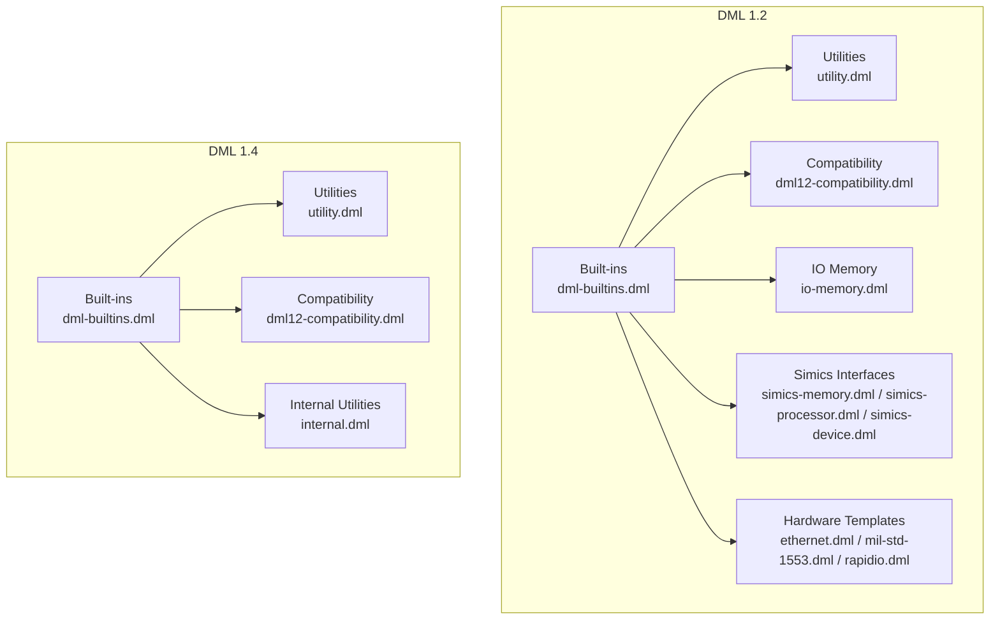
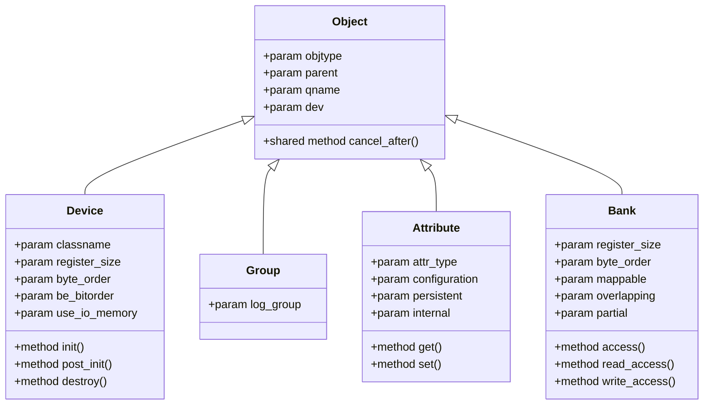
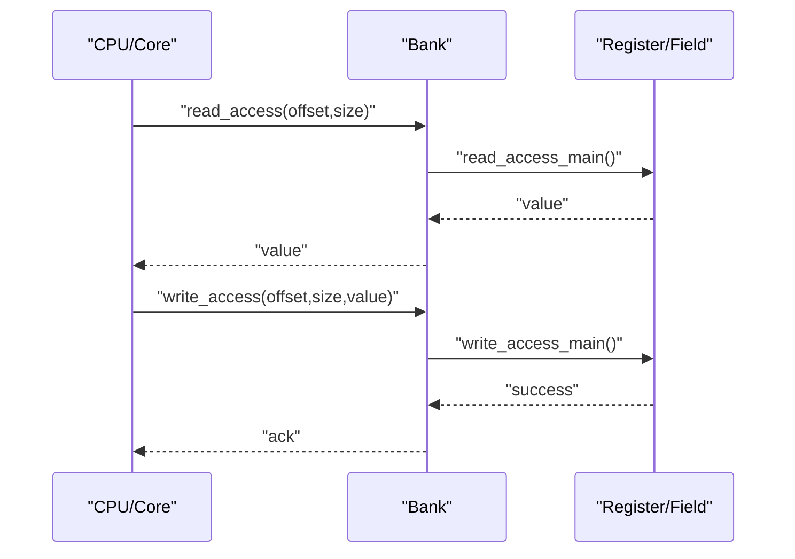
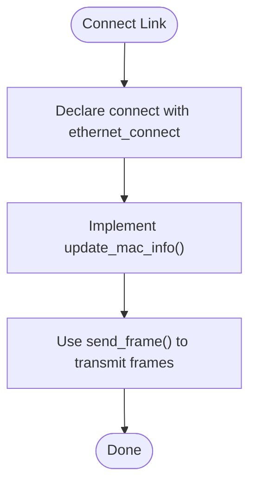
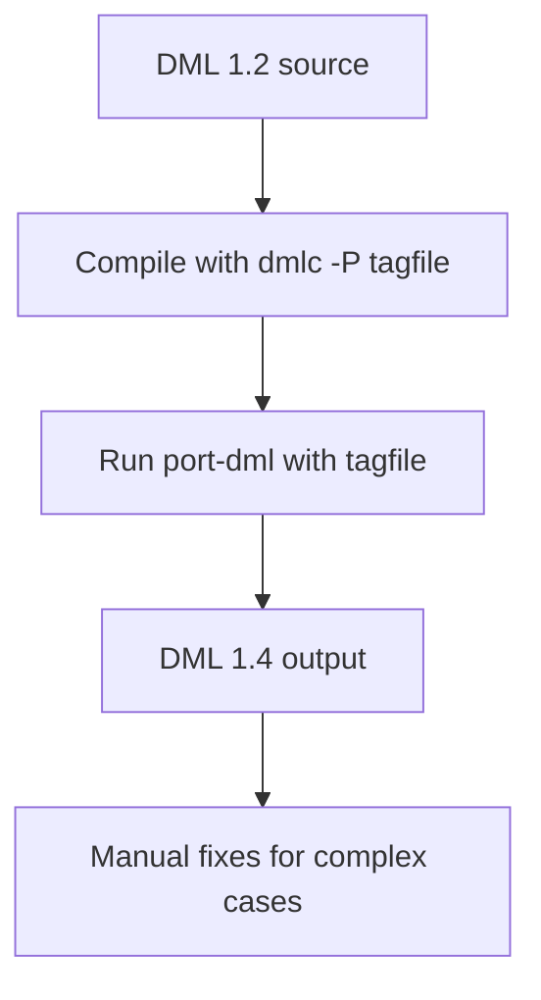
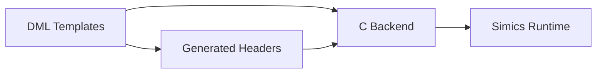
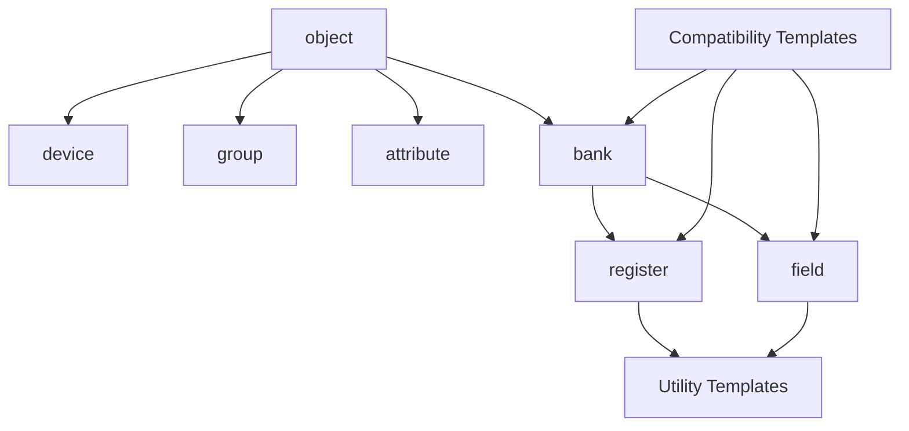

# Template Library Reference

<cite>
**Referenced Files in This Document**
- [dml-builtins.dml (1.2)](file://lib/1.2/dml-builtins.dml)
- [dml-builtins.dml (1.4)](file://lib/1.4/dml-builtins.dml)
- [utility.dml (1.2)](file://lib/1.2/utility.dml)
- [utility.dml (1.4)](file://lib/1.4/utility.dml)
- [dml12-compatibility.dml (1.2)](file://lib/1.2/dml12-compatibility.dml)
- [dml12-compatibility.dml (1.4)](file://lib/1.4/dml12-compatibility.dml)
- [io-memory.dml (1.2)](file://lib/1.2/io-memory.dml)
- [simics-memory.dml (1.2)](file://lib/1.2/simics-memory.dml)
- [simics-processor.dml (1.2)](file://lib/1.2/simics-processor.dml)
- [ethernet.dml (1.2)](file://lib/1.2/ethernet.dml)
- [mil-std-1553.dml (1.2)](file://lib/1.2/mil-std-1553.dml)
- [rapidio.dml (1.2)](file://lib/1.2/rapidio.dml)
- [simics-device.dml (1.2)](file://lib/1.2/simics-device.dml)
- [internal.dml (1.4)](file://lib/1.4/internal.dml)
- [standard-templates.md (1.2)](file://doc/1.2/standard-templates.md)
- [port-dml.md (1.4)](file://doc/1.4/port-dml.md)
</cite>

## Table of Contents
1. [Introduction](#introduction)
2. [Project Structure](#project-structure)
3. [Core Components](#core-components)
4. [Architecture Overview](#architecture-overview)
5. [Detailed Component Analysis](#detailed-component-analysis)
6. [Dependency Analysis](#dependency-analysis)
7. [Performance Considerations](#performance-considerations)
8. [Troubleshooting Guide](#troubleshooting-guide)
9. [Conclusion](#conclusion)
10. [Appendices](#appendices)

## Introduction
This document is a comprehensive reference to the Device Modeling Language (DML) template library. It covers:
- Built-in templates for object lifecycle, attributes, banks, registers, and fields
- Standard utility templates for common register behaviors (read-only, write-only, constants, reserved, etc.)
- Hardware-specific templates for buses, peripherals, and processor interfaces
- Compatibility templates for migrating from DML 1.2 to 1.4
- Template syntax, parameter usage, inheritance, composition, and C code generation linkage

The goal is to help you model devices efficiently, reuse proven architectures, and maintain compatibility across DML versions.

## Project Structure
The DML template library is organized by DML version and domain:
- Built-in templates: device, group, object, bank, register, field, attribute, and interfaces
- Utility templates: common register behaviors and reset patterns
- Hardware-specific templates: memory interfaces, bus protocols, and processor interfaces
- Compatibility templates: helpers for porting from DML 1.2 to 1.4
- Internal utilities: C macro and bit manipulation helpers for 1.4

**Diagram sources**
- [dml-builtins.dml (1.2)](file://lib/1.2/dml-builtins.dml#L1-L2074)
- [utility.dml (1.2)](file://lib/1.2/utility.dml#L1-L894)
- [dml12-compatibility.dml (1.2)](file://lib/1.2/dml12-compatibility.dml#L1-L470)
- [io-memory.dml (1.2)](file://lib/1.2/io-memory.dml#L1-L50)
- [simics-memory.dml (1.2)](file://lib/1.2/simics-memory.dml#L1-L29)
- [simics-processor.dml (1.2)](file://lib/1.2/simics-processor.dml#L1-L12)
- [simics-device.dml (1.2)](file://lib/1.2/simics-device.dml#L1-L18)
- [ethernet.dml (1.2)](file://lib/1.2/ethernet.dml#L1-L48)
- [mil-std-1553.dml (1.2)](file://lib/1.2/mil-std-1553.dml#L1-L27)
- [rapidio.dml (1.2)](file://lib/1.2/rapidio.dml#L1-L211)
- [dml-builtins.dml (1.4)](file://lib/1.4/dml-builtins.dml#L1-L4128)
- [utility.dml (1.4)](file://lib/1.4/utility.dml#L1-L1490)
- [dml12-compatibility.dml (1.4)](file://lib/1.4/dml12-compatibility.dml#L1-L15)
- [internal.dml (1.4)](file://lib/1.4/internal.dml#L1-L94)

**Section sources**
- [dml-builtins.dml (1.2)](file://lib/1.2/dml-builtins.dml#L1-L2074)
- [dml-builtins.dml (1.4)](file://lib/1.4/dml-builtins.dml#L1-L4128)
- [utility.dml (1.2)](file://lib/1.2/utility.dml#L1-L894)
- [utility.dml (1.4)](file://lib/1.4/utility.dml#L1-L1490)
- [dml12-compatibility.dml (1.2)](file://lib/1.2/dml12-compatibility.dml#L1-L470)
- [dml12-compatibility.dml (1.4)](file://lib/1.4/dml12-compatibility.dml#L1-L15)
- [io-memory.dml (1.2)](file://lib/1.2/io-memory.dml#L1-L50)
- [simics-memory.dml (1.2)](file://lib/1.2/simics-memory.dml#L1-L29)
- [simics-processor.dml (1.2)](file://lib/1.2/simics-processor.dml#L1-L12)
- [simics-device.dml (1.2)](file://lib/1.2/simics-device.dml#L1-L18)
- [ethernet.dml (1.2)](file://lib/1.2/ethernet.dml#L1-L48)
- [mil-std-1553.dml (1.2)](file://lib/1.2/mil-std-1553.dml#L1-L27)
- [rapidio.dml (1.2)](file://lib/1.2/rapidio.dml#L1-L211)
- [internal.dml (1.4)](file://lib/1.4/internal.dml#L1-L94)

## Core Components
This section summarizes the core template families and their roles.

- Universal object model
  - object: base template for all objects; provides identity, hierarchy, and qname
  - device: top-level device object; orchestrates init/post_init/destroy
  - group: container for organizing objects
  - attribute: configuration attributes with typed getters/setters

- Bank and register model
  - bank: memory-mapped region with access callbacks and instrumentation
  - register/field: memory-backed or constant values with read/write behaviors
  - attribute: typed configuration attributes

- Reset and lifecycle
  - power_on_reset, hard_reset, soft_reset: reset triggers and recursion
  - init, post_init, destroy: lifecycle hooks

- Utility templates (common behaviors)
  - read_only, write_only, read_zero, ignore_write, constant, read_constant, silent_constant, reserved, zeros, ones, ignore, undocumented, unimplemented, clear_on_read, write_1_only, write_0_only, write_1_clears, unmapped, signed, noalloc, sticky, no_reset

- Compatibility and porting
  - dml12-compatibility.dml: bridge 1.2/1.4 APIs and behaviors
  - port-dml.md: automated migration guide

**Section sources**
- [dml-builtins.dml (1.2)](file://lib/1.2/dml-builtins.dml#L164-L800)
- [dml-builtins.dml (1.4)](file://lib/1.4/dml-builtins.dml#L525-L670)
- [utility.dml (1.2)](file://lib/1.2/utility.dml#L1-L894)
- [utility.dml (1.4)](file://lib/1.4/utility.dml#L1-L1490)
- [dml12-compatibility.dml (1.2)](file://lib/1.2/dml12-compatibility.dml#L1-L470)
- [dml12-compatibility.dml (1.4)](file://lib/1.4/dml12-compatibility.dml#L1-L15)

## Architecture Overview
The DML template library composes a layered architecture:
- Built-in templates define the object model and memory access
- Utility templates encapsulate common register behaviors
- Hardware-specific templates implement protocol interfaces
- Compatibility templates smooth migration between DML versions
- Internal utilities expose C helpers for 1.4

**Diagram sources**
- [dml-builtins.dml (1.2)](file://lib/1.2/dml-builtins.dml#L164-L800)
- [dml-builtins.dml (1.4)](file://lib/1.4/dml-builtins.dml#L525-L670)

## Detailed Component Analysis

### Built-in Templates (Object Model)
- object
  - Provides identity, hierarchy, and qname
  - Supports cancel_after() for event cleanup
- device
  - Top-level device; integrates init/post_init/destroy
  - Exposes class name, register defaults, and API version
- group
  - Non-simics container; enforces namespace rules
- attribute
  - Typed configuration attributes with get/set wrappers
  - Handles registration flags and documentation

Key behaviors:
- Automatic parameter propagation (e.g., register_size, byte_order)
- Hierarchical traversal via _each_* sequences
- Event cancellation scoped to object lifetime

**Section sources**
- [dml-builtins.dml (1.2)](file://lib/1.2/dml-builtins.dml#L164-L390)
- [dml-builtins.dml (1.4)](file://lib/1.4/dml-builtins.dml#L525-L670)

### Bank and Access Control
- bank
  - Manages memory access, byte order, overlapping/partial mappings
  - Registers callbacks for before/after read/write
  - Implements miss handling and logging
- register/field
  - Backed storage or constant values
  - Compose with utility templates to define behavior

Access flow:

**Diagram sources**
- [dml-builtins.dml (1.2)](file://lib/1.2/dml-builtins.dml#L391-L790)
- [dml-builtins.dml (1.4)](file://lib/1.4/dml-builtins.dml#L1-L4128)

**Section sources**
- [dml-builtins.dml (1.2)](file://lib/1.2/dml-builtins.dml#L391-L790)
- [dml-builtins.dml (1.4)](file://lib/1.4/dml-builtins.dml#L1-L4128)

### Utility Templates (Common Behaviors)
- Reset templates
  - power_on_reset, hreset, sreset: ports and recursive reset
  - soft_reset_val: configurable soft reset value
- Read/write behavior templates
  - read_only, write_only, read_zero, ignore_write
  - constant, read_constant, silent_constant, reserved, zeros, ones
  - ignore, undocumented, unimplemented, clear_on_read
  - write_1_only, write_0_only, write_1_clears
  - unmapped, signed, noalloc, sticky, no_reset

Usage patterns:
- Compose templates to achieve desired semantics
- Override methods selectively while preserving defaults
- Use parameters to tune behavior (e.g., read_val, soft_reset_val)

**Section sources**
- [utility.dml (1.2)](file://lib/1.2/utility.dml#L1-L894)
- [utility.dml (1.4)](file://lib/1.4/utility.dml#L1-L1490)
- [standard-templates.md (1.2)](file://doc/1.2/standard-templates.md#L1-L608)

### Hardware-Specific Templates
- Memory interfaces
  - simics-memory.dml constants for memory-related interfaces
  - io-memory.dml implements io_memory interface selection and routing
- Bus and peripheral interfaces
  - ethernet.dml: ethernet_connect template for direct link connectivity
  - mil-std-1553.dml: helper for phase names and related constants
  - rapidio.dml: architecture-specific register templates and maintenance helpers
- Processor interfaces
  - simics-processor.dml: processor-related interface constants
- Device interfaces
  - simics-device.dml: interrupt, port_space, pin, signal, and related constants

Example: Ethernet connectivity

**Diagram sources**
- [ethernet.dml (1.2)](file://lib/1.2/ethernet.dml#L1-L48)

**Section sources**
- [simics-memory.dml (1.2)](file://lib/1.2/simics-memory.dml#L1-L29)
- [io-memory.dml (1.2)](file://lib/1.2/io-memory.dml#L1-L50)
- [ethernet.dml (1.2)](file://lib/1.2/ethernet.dml#L1-L48)
- [mil-std-1553.dml (1.2)](file://lib/1.2/mil-std-1553.dml#L1-L27)
- [rapidio.dml (1.2)](file://lib/1.2/rapidio.dml#L1-L211)
- [simics-processor.dml (1.2)](file://lib/1.2/simics-processor.dml#L1-L12)
- [simics-device.dml (1.2)](file://lib/1.2/simics-device.dml#L1-L18)

### Compatibility Templates (DML 1.2 to 1.4 Migration)
- Purpose
  - Bridge differences in memory access, field/register methods, and reset ports
  - Provide compatibility wrappers for io_memory_access and transaction_access
- Key templates
  - dml12_compat_io_memory_access, dml12_compat_read_register, dml12_compat_write_register, dml12_compat_read_field, dml12_compat_write_field
  - hreset/sreset wrappers for signal ports
  - Dummy templates for renamed or absent constructs in 1.2

Migration workflow:

**Diagram sources**
- [port-dml.md (1.4)](file://doc/1.4/port-dml.md#L1-L77)

**Section sources**
- [dml12-compatibility.dml (1.2)](file://lib/1.2/dml12-compatibility.dml#L1-L470)
- [dml12-compatibility.dml (1.4)](file://lib/1.4/dml12-compatibility.dml#L1-L15)
- [port-dml.md (1.4)](file://doc/1.4/port-dml.md#L1-L77)

### Relationship to C Code Generation
- Built-in templates declare extern C functions and headers for callbacks and instrumentation
- bank templates register before/after read/write callbacks and manage connection vectors
- utility templates log spec violations and unimplemented behaviors
- 1.4 internal.dml exposes C macros and bit utilities used by templates

**Diagram sources**
- [dml-builtins.dml (1.2)](file://lib/1.2/dml-builtins.dml#L14-L170)
- [dml-builtins.dml (1.4)](file://lib/1.4/dml-builtins.dml#L13-L175)
- [internal.dml (1.4)](file://lib/1.4/internal.dml#L1-L94)

**Section sources**
- [dml-builtins.dml (1.2)](file://lib/1.2/dml-builtins.dml#L14-L170)
- [dml-builtins.dml (1.4)](file://lib/1.4/dml-builtins.dml#L13-L175)
- [internal.dml (1.4)](file://lib/1.4/internal.dml#L1-L94)

## Dependency Analysis
Template dependencies and relationships:
- object is the base for device, group, attribute, bank, register, field
- bank depends on register/field behaviors and instrumentation
- utility templates compose with register/field to alter behavior
- compatibility templates adapt 1.2 constructs for 1.4

**Diagram sources**
- [dml-builtins.dml (1.2)](file://lib/1.2/dml-builtins.dml#L164-L800)
- [dml-builtins.dml (1.4)](file://lib/1.4/dml-builtins.dml#L525-L670)
- [utility.dml (1.2)](file://lib/1.2/utility.dml#L1-L894)
- [utility.dml (1.4)](file://lib/1.4/utility.dml#L1-L1490)
- [dml12-compatibility.dml (1.2)](file://lib/1.2/dml12-compatibility.dml#L1-L470)

**Section sources**
- [dml-builtins.dml (1.2)](file://lib/1.2/dml-builtins.dml#L164-L800)
- [dml-builtins.dml (1.4)](file://lib/1.4/dml-builtins.dml#L525-L670)
- [utility.dml (1.2)](file://lib/1.2/utility.dml#L1-L894)
- [utility.dml (1.4)](file://lib/1.4/utility.dml#L1-L1490)
- [dml12-compatibility.dml (1.2)](file://lib/1.2/dml12-compatibility.dml#L1-L470)

## Performance Considerations
- Prefer small, focused templates to minimize overhead
- Use noalloc for constant or computed values to avoid allocation
- Limit logging in hot paths; leverage “silent” variants where appropriate
- Use overlapping/partial mappings judiciously; they add complexity and potential performance cost
- Keep reset handlers concise; avoid heavy computation in reset paths

## Troubleshooting Guide
Common issues and resolutions:
- Oversized memory access
  - Symptom: error thrown for access larger than 8 bytes
  - Resolution: ensure access sizes match bank/register widths
- Unmapped offsets
  - Symptom: miss handling logs and exceptions
  - Resolution: define offset or use unmapped template intentionally
- Byte order mismatches
  - Symptom: incorrect read/write values
  - Resolution: set byte_order consistently across device/bank/register
- Logging verbosity
  - Symptom: excessive spec_viol or unimplemented logs
  - Resolution: use silent variants (silent_constant, silent_unimplemented) or adjust log levels

**Section sources**
- [dml-builtins.dml (1.2)](file://lib/1.2/dml-builtins.dml#L450-L472)
- [dml-builtins.dml (1.4)](file://lib/1.4/dml-builtins.dml#L1-L4128)
- [utility.dml (1.2)](file://lib/1.2/utility.dml#L1-L894)
- [utility.dml (1.4)](file://lib/1.4/utility.dml#L1-L1490)

## Conclusion
The DML template library provides a robust, composable foundation for device modeling:
- Use built-in templates to define the object model and memory access
- Apply utility templates to encode common register behaviors
- Leverage hardware-specific templates for protocol interfaces
- Employ compatibility templates to migrate smoothly between DML versions
- Connect templates to C code generation via declared externs and headers

Adopting reusable template architectures accelerates development, improves correctness, and simplifies maintenance.

## Appendices

### Template Syntax and Composition Tips
- Inherit from the narrowest template that provides the needed behavior (e.g., write_field vs. register)
- Use parameters to configure behavior without duplicating code
- Compose multiple templates to layer behaviors (e.g., read_only + clear_on_read)
- Override methods selectively and call default() to preserve base behavior

### Practical Patterns
- Constant registers: combine read_constant with noalloc and no_reset
- Acknowledge bits: write_1_clears on status registers
- Reserved fields: reserved with write-only side-effects where needed
- Reset-driven initialization: soft_reset_val for configurable reset values

### Migration Checklist (DML 1.2 → 1.4)
- Run dmlc with -P to generate tagfile
- Apply port-dml to convert automatically
- Review warnings for unused code and apply manual fixes
- Replace renamed templates (unimpl → unimplemented, etc.)
- Validate io_memory_access and field/register overrides with compatibility wrappers if needed

**Section sources**
- [port-dml.md (1.4)](file://doc/1.4/port-dml.md#L1-L77)
- [dml12-compatibility.dml (1.2)](file://lib/1.2/dml12-compatibility.dml#L465-L470)
- [standard-templates.md (1.2)](file://doc/1.2/standard-templates.md#L1-L608)