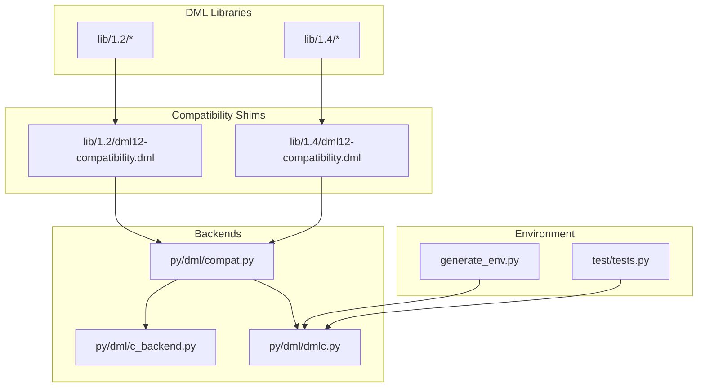
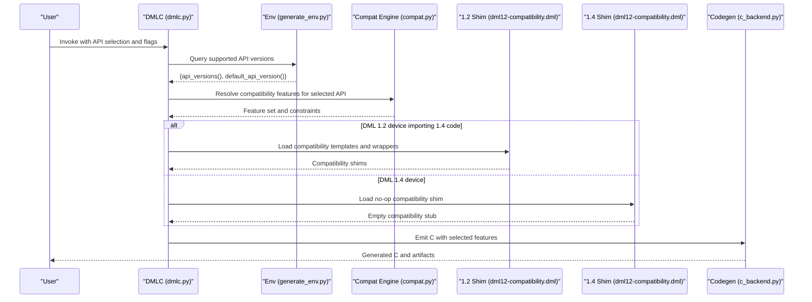
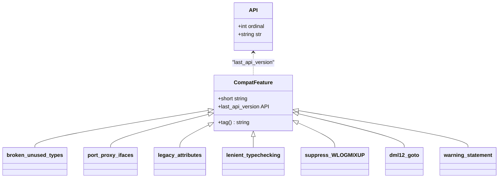
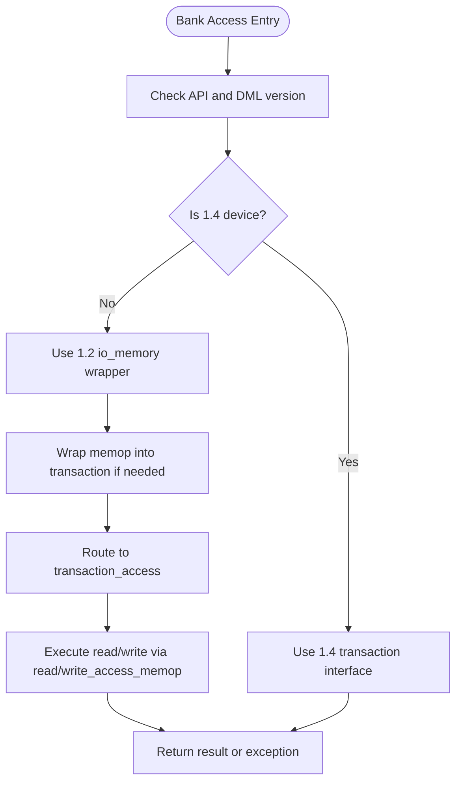
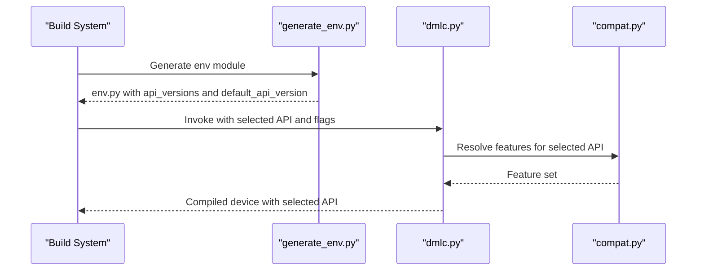
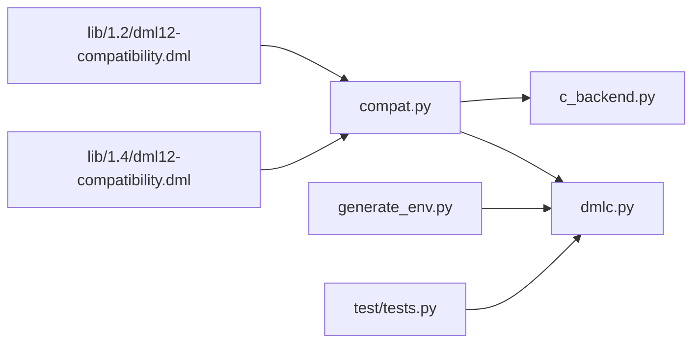

# API Version Management

<cite>
**Referenced Files in This Document**
- [README.md](file://README.md)
- [RELEASENOTES.md](file://RELEASENOTES.md)
- [RELEASENOTES-1.2.md](file://RELEASENOTES-1.2.md)
- [RELEASENOTES-1.4.md](file://RELEASENOTES-1.4.md)
- [dml12-compatibility.dml (1.2)](file://lib/1.2/dml12-compatibility.dml)
- [dml12-compatibility.dml (1.4)](file://lib/1.4/dml12-compatibility.dml)
- [simics-api.dml](file://lib/1.2/simics-api.dml)
- [internal.dml](file://lib/1.4/internal.dml)
- [compat.py](file://py/dml/compat.py)
- [c_backend.py](file://py/dml/c_backend.py)
- [dmlc.py](file://py/dml/dmlc.py)
- [generate_env.py](file://generate_env.py)
- [tests.py](file://test/tests.py)
</cite>

## Table of Contents
1. [Introduction](#introduction)
2. [Project Structure](#project-structure)
3. [Core Components](#core-components)
4. [Architecture Overview](#architecture-overview)
5. [Detailed Component Analysis](#detailed-component-analysis)
6. [Dependency Analysis](#dependency-analysis)
7. [Performance Considerations](#performance-considerations)
8. [Troubleshooting Guide](#troubleshooting-guide)
9. [Conclusion](#conclusion)
10. [Appendices](#appendices)

## Introduction
This document explains how the Device Modeling Language (DML) manages API versions and compatibility across DML versions. It covers Simics API versioning mechanisms, backward compatibility strategies, version-specific feature availability, the compatibility layer implementation, API evolution patterns, and version detection systems. It also documents environment variable configuration for API selection, runtime API switching, and compatibility testing procedures. Guidance is provided for maintaining backward compatibility in custom extensions, handling deprecated APIs, planning migration timelines, and integrating with different Simics versions and deployment scenarios.

## Project Structure
The repository organizes DML language libraries by DML version and Simics API version, with compatibility shims and backend modules that implement version-aware behavior. Key areas:
- DML libraries per language version (1.2 and 1.4) under lib/
- Compatibility shims for cross-version interoperability
- Backend modules for code generation and compatibility feature management
- Test harnesses that validate API and DML version combinations

**Diagram sources**
- [dml12-compatibility.dml (1.2)](file://lib/1.2/dml12-compatibility.dml#L1-L470)
- [dml12-compatibility.dml (1.4)](file://lib/1.4/dml12-compatibility.dml#L1-L15)
- [compat.py](file://py/dml/compat.py#L1-L432)
- [c_backend.py](file://py/dml/c_backend.py#L1-L200)
- [dmlc.py](file://py/dml/dmlc.py#L1-L200)
- [generate_env.py](file://generate_env.py#L1-L22)
- [tests.py](file://test/tests.py#L2081-L2117)

**Section sources**
- [README.md](file://README.md#L1-L117)
- [RELEASENOTES.md](file://RELEASENOTES.md#L1-L248)
- [RELEASENOTES-1.2.md](file://RELEASENOTES-1.2.md#L1-L121)
- [RELEASENOTES-1.4.md](file://RELEASENOTES-1.4.md#L1-L362)

## Core Components
- Simics API version enumeration and compatibility features: Defines supported API versions and a catalog of compatibility features that gate version-specific behavior and deprecations.
- Compatibility shims:
  - 1.2 shim: Provides 1.4-style templates and wrappers to reuse 1.4 code from 1.2 devices, including wrappers for register/bank access and event templates.
  - 1.4 shim: No-op shim for 1.4 devices that import 1.2 compatibility templates.
- Backend compatibility engine: Applies selected compatibility features during code generation and enforces version-specific constraints.
- Environment and test integration: Exposes available API versions and runs compatibility tests across API/DML combinations.

**Section sources**
- [compat.py](file://py/dml/compat.py#L8-L432)
- [dml12-compatibility.dml (1.2)](file://lib/1.2/dml12-compatibility.dml#L1-L470)
- [dml12-compatibility.dml (1.4)](file://lib/1.4/dml12-compatibility.dml#L1-L15)
- [c_backend.py](file://py/dml/c_backend.py#L61-L96)
- [generate_env.py](file://generate_env.py#L10-L18)
- [tests.py](file://test/tests.py#L2081-L2117)

## Architecture Overview
The DML compiler selects a Simics API version and applies a set of compatibility features to reconcile language features and API behaviors. The compatibility layer ensures that 1.4 code can be imported into 1.2 devices and that deprecated features remain usable within supported API lifecycles.

**Diagram sources**
- [dmlc.py](file://py/dml/dmlc.py#L24-L25)
- [generate_env.py](file://generate_env.py#L10-L18)
- [compat.py](file://py/dml/compat.py#L27-L49)
- [dml12-compatibility.dml (1.2)](file://lib/1.2/dml12-compatibility.dml#L66-L189)
- [dml12-compatibility.dml (1.4)](file://lib/1.4/dml12-compatibility.dml#L10-L14)
- [c_backend.py](file://py/dml/c_backend.py#L86-L95)

## Detailed Component Analysis

### Compatibility Features Catalog
The compatibility engine enumerates features that control deprecated or version-specific behaviors. Each feature is bound to a maximum API version and carries a short description and rationale aligned with migration timelines.

Key categories:
- Legacy compatibility: Preserves older API behaviors (e.g., proxy interfaces/attributes, legacy attribute registration).
- Strictness toggles: Controls type checking strictness and log level semantics.
- Migration aids: Enables temporary workarounds (e.g., lenient typechecking) and warnings suppression.
- Deprecated syntax: Allows legacy constructs (e.g., goto, warning statement) under controlled conditions.

**Diagram sources**
- [compat.py](file://py/dml/compat.py#L8-L432)

**Section sources**
- [compat.py](file://py/dml/compat.py#L52-L432)

### 1.2 Compatibility Shim
The 1.2 shim provides:
- Wrappers for register/bank access to bridge 1.2’s io_memory and 1.4’s transaction interfaces.
- Compatibility templates for register/field access and event templates to reuse 1.4 code from 1.2.
- Dummy templates mirroring 1.4 standard templates to avoid missing symbols when importing 1.4 code into 1.2.

Notable mechanisms:
- Bank-level wrappers for io_memory_access and transaction_access to route transactions and memops appropriately.
- Inline helpers to construct memops and wrap transactions for compatibility.
- Event templates with compatibility helpers to preserve 1.4-style event usage in 1.2.

**Diagram sources**
- [dml12-compatibility.dml (1.2)](file://lib/1.2/dml12-compatibility.dml#L66-L189)
- [dml12-compatibility.dml (1.2)](file://lib/1.2/dml12-compatibility.dml#L290-L320)

**Section sources**
- [dml12-compatibility.dml (1.2)](file://lib/1.2/dml12-compatibility.dml#L66-L189)
- [dml12-compatibility.dml (1.2)](file://lib/1.2/dml12-compatibility.dml#L290-L359)

### 1.4 Compatibility Shim
The 1.4 shim is intentionally a no-op for 1.4 devices that import compatibility templates from 1.2. It ensures that 1.4 code remains unaffected by compatibility shims while still enabling imports from 1.2.

**Section sources**
- [dml12-compatibility.dml (1.4)](file://lib/1.4/dml12-compatibility.dml#L10-L14)

### Simics API Exposure
- 1.2 API surface: The 1.2 API library exposes a subset of Simics utilities and logging functions, imported from Simics headers and standard libraries.
- 1.4 internal utilities: The 1.4 internal library exposes additional utility macros and conversion routines to DML, intended for internal use.

**Section sources**
- [simics-api.dml](file://lib/1.2/simics-api.dml#L1-L131)
- [internal.dml](file://lib/1.4/internal.dml#L1-L94)

### Version Detection and Selection
- Environment integration: The environment generator produces a Python module that exposes supported API versions and the default API version to the build system.
- Command-line and flags: The DMLC entrypoint integrates with the compatibility engine and environment to select API versions and apply compatibility features.
- Tests: The test harness enumerates API versions and runs import tests across DML 1.2 and 1.4 to validate compatibility.

**Diagram sources**
- [generate_env.py](file://generate_env.py#L10-L18)
- [dmlc.py](file://py/dml/dmlc.py#L24-L25)
- [compat.py](file://py/dml/compat.py#L27-L49)

**Section sources**
- [generate_env.py](file://generate_env.py#L10-L18)
- [dmlc.py](file://py/dml/dmlc.py#L24-L25)
- [tests.py](file://test/tests.py#L2106-L2114)

## Dependency Analysis
The compatibility layer depends on:
- API version enumeration and feature catalogs
- Language version awareness in the backend
- Shim libraries that adapt 1.4 features for 1.2
- Test harness that validates API/DML combinations

**Diagram sources**
- [compat.py](file://py/dml/compat.py#L27-L49)
- [c_backend.py](file://py/dml/c_backend.py#L1-L200)
- [dmlc.py](file://py/dml/dmlc.py#L1-L200)
- [dml12-compatibility.dml (1.2)](file://lib/1.2/dml12-compatibility.dml#L1-L470)
- [dml12-compatibility.dml (1.4)](file://lib/1.4/dml12-compatibility.dml#L1-L15)
- [generate_env.py](file://generate_env.py#L10-L18)
- [tests.py](file://test/tests.py#L2106-L2114)

**Section sources**
- [compat.py](file://py/dml/compat.py#L27-L49)
- [c_backend.py](file://py/dml/c_backend.py#L1-L200)
- [dmlc.py](file://py/dml/dmlc.py#L1-L200)
- [dml12-compatibility.dml (1.2)](file://lib/1.2/dml12-compatibility.dml#L1-L470)
- [dml12-compatibility.dml (1.4)](file://lib/1.4/dml12-compatibility.dml#L1-L15)
- [generate_env.py](file://generate_env.py#L10-L18)
- [tests.py](file://test/tests.py#L2106-L2114)

## Performance Considerations
- Compatibility feature toggles can influence code generation volume and runtime overhead. For example, proxy interface generation and legacy attribute registration may add extra registration paths.
- Strictness toggles (e.g., lenient typechecking) can reduce compile-time checks at the cost of runtime safety; prefer strict mode for new development.
- Transaction vs io_memory routing in the 1.2 shim adds indirection; minimize unnecessary wrapping by aligning bank interfaces with 1.4 transaction semantics when feasible.

[No sources needed since this section provides general guidance]

## Troubleshooting Guide
Common issues and resolutions:
- Importing 1.4 code into 1.2 devices: Ensure the 1.2 compatibility shim is included and use compatibility templates for register/field access and events.
- Deprecated constructs: Use appropriate compatibility features to temporarily enable legacy syntax or behaviors during migration.
- Attribute registration failures: If legacy attributes are required, enable the legacy attribute registration feature; otherwise migrate to modern attribute types.
- Logging behavior: If logs inside shared methods appear on the device object, enable the relevant compatibility feature to preserve legacy logging semantics.

**Section sources**
- [dml12-compatibility.dml (1.2)](file://lib/1.2/dml12-compatibility.dml#L66-L189)
- [compat.py](file://py/dml/compat.py#L218-L234)
- [compat.py](file://py/dml/compat.py#L180-L190)

## Conclusion
DML’s API version management combines explicit version statements, compatibility shims, and a robust compatibility feature catalog to maintain backward compatibility across DML 1.2 and 1.4 while enabling migration to newer Simics APIs. The environment and test infrastructure ensure consistent selection and validation of API versions. By leveraging compatibility features and shims, developers can incrementally modernize models, handle deprecated APIs responsibly, and integrate seamlessly across deployment environments.

[No sources needed since this section summarizes without analyzing specific files]

## Appendices

### Environment Variables and Configuration
- DMLC_DIR: Points to the host-type bin directory for locally built DMLC.
- DMLC_PATHSUBST: Rewrites error paths to source files for clearer diagnostics.
- DMLC_DEBUG: Enables verbose exception reporting.
- DMLC_CC and DMLC_PROFILE: Control compiler selection and profiling.
- DMLC_DUMP_INPUT_FILES and DMLC_GATHER_SIZE_STATISTICS: Aid in isolating and optimizing builds.

**Section sources**
- [README.md](file://README.md#L46-L117)

### API Evolution Patterns and Deprecations
- Transaction interface replacing io_memory in newer APIs.
- Strict type checking and log semantics becoming mandatory.
- Deprecated statements and syntax gradually removed with compatibility gates.
- Provisional features stabilized over time (e.g., explicit parameter declarations).

**Section sources**
- [RELEASENOTES.md](file://RELEASENOTES.md#L104-L114)
- [RELEASENOTES-1.4.md](file://RELEASENOTES-1.4.md#L247-L247)
- [RELEASENOTES-1.2.md](file://RELEASENOTES-1.2.md#L87-L91)

### Compatibility Testing Procedures
- Automated tests enumerate API versions and run import tests for DML 1.2 and 1.4.
- Limited API testing applies to specific header files to avoid excessive test runs.
- Use the test harness to validate cross-version compatibility and regressions.

**Section sources**
- [tests.py](file://test/tests.py#L2081-L2117)