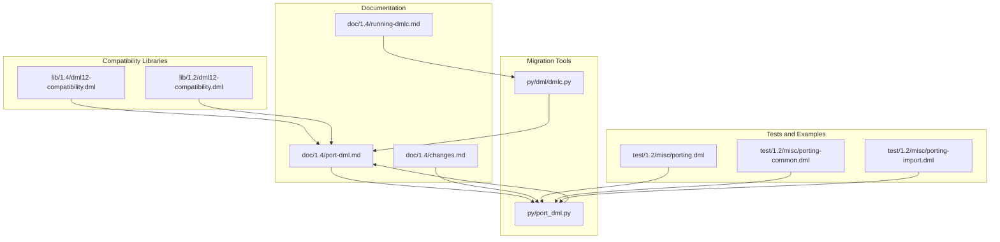
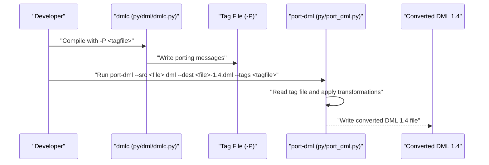
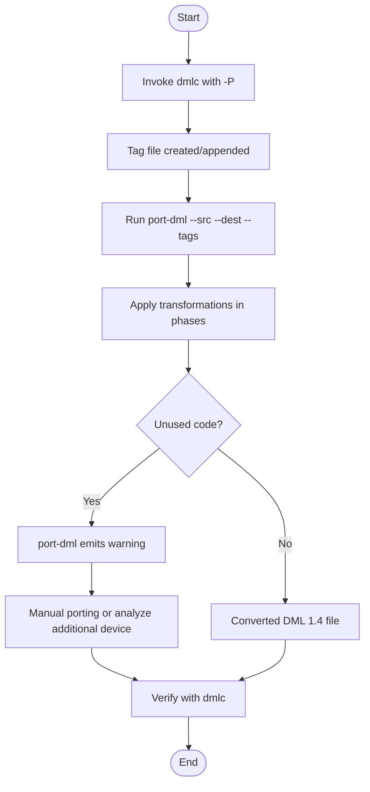
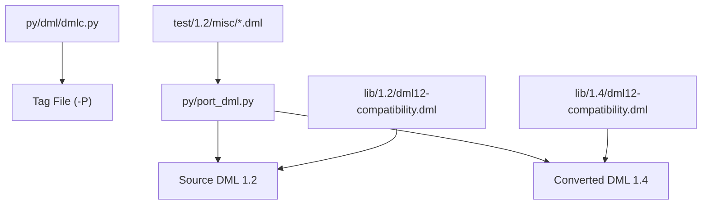

# DML 1.2 to 1.4 Migration

<cite>
**Referenced Files in This Document**
- [port-dml.md](file://doc/1.4/port-dml.md)
- [changes.md](file://doc/1.4/changes.md)
- [running-dmlc.md](file://doc/1.4/running-dmlc.md)
- [port_dml.py](file://py/port_dml.py)
- [dmlc.py](file://py/dml/dmlc.py)
- [dml12-compatibility.dml (1.4)](file://lib/1.4/dml12-compatibility.dml)
- [dml12-compatibility.dml (1.2)](file://lib/1.2/dml12-compatibility.dml)
- [porting.dml](file://test/1.2/misc/porting.dml)
- [porting-common.dml](file://test/1.2/misc/porting-common.dml)
- [porting-import.dml](file://test/1.2/misc/porting-import.dml)
- [dead_dml_methods.py](file://py/dead_dml_methods.py)
</cite>

## Table of Contents
1. [Introduction](#introduction)
2. [Project Structure](#project-structure)
3. [Core Components](#core-components)
4. [Architecture Overview](#architecture-overview)
5. [Detailed Component Analysis](#detailed-component-analysis)
6. [Dependency Analysis](#dependency-analysis)
7. [Performance Considerations](#performance-considerations)
8. [Troubleshooting Guide](#troubleshooting-guide)
9. [Conclusion](#conclusion)
10. [Appendices](#appendices)

## Introduction
This document explains how to migrate Device Modeling Language (DML) 1.2 code to DML 1.4, focusing on the automatic conversion process using the port-dml script and the port-dml-module wrapper. It describes the tag file generation performed by dmlc with the -P flag, outlines manual porting procedures, highlights known limitations of automatic conversion, and compares automatic versus manual approaches. It also provides step-by-step migration workflows, best practices for edge cases, verification procedures, and guidance on handling unused code sections. Finally, it clarifies the relationship between DML 1.2 compatibility libraries and DML 1.4 features.

## Project Structure
The migration-related materials are organized across documentation, Python migration tools, DML standard libraries, and test suites that exercise porting scenarios.

- Documentation:
  - Migration guide and porting workflow: doc/1.4/port-dml.md
  - Language differences between 1.2 and 1.4: doc/1.4/changes.md
  - Compiler usage and options: doc/1.4/running-dmlc.md

- Migration tooling:
  - port-dml script implementation: py/port_dml.py
  - dmlc compiler entry point and -P tag file generation: py/dml/dmlc.py

- Compatibility libraries:
  - DML 1.4 compatibility stubs: lib/1.4/dml12-compatibility.dml
  - DML 1.2 compatibility wrappers: lib/1.2/dml12-compatibility.dml

- Test and examples:
  - Comprehensive 1.2-to-1.4 porting test suite: test/1.2/misc/porting.dml
  - Shared/common code used across tests: test/1.2/misc/porting-common.dml
  - Import test for port-dml import insertion: test/1.2/misc/porting-import.dml

**Diagram sources**
- [port-dml.md](file://doc/1.4/port-dml.md#L1-L77)
- [changes.md](file://doc/1.4/changes.md#L1-L249)
- [running-dmlc.md](file://doc/1.4/running-dmlc.md#L1-L186)
- [port_dml.py](file://py/port_dml.py#L1-L1201)
- [dmlc.py](file://py/dml/dmlc.py#L1-L811)
- [dml12-compatibility.dml (1.4)](file://lib/1.4/dml12-compatibility.dml#L1-L15)
- [dml12-compatibility.dml (1.2)](file://lib/1.2/dml12-compatibility.dml#L1-L470)
- [porting.dml](file://test/1.2/misc/porting.dml#L1-L477)
- [porting-common.dml](file://test/1.2/misc/porting-common.dml#L1-L137)
- [porting-import.dml](file://test/1.2/misc/porting-import.dml#L1-L25)

**Section sources**
- [port-dml.md](file://doc/1.4/port-dml.md#L1-L77)
- [changes.md](file://doc/1.4/changes.md#L1-L249)
- [running-dmlc.md](file://doc/1.4/running-dmlc.md#L1-L186)

## Core Components
- port-dml script: Applies machine-readable porting tags to convert DML 1.2 to DML 1.4. It parses a tag file produced by dmlc -P and transforms source code accordingly, handling many syntactic and semantic differences between 1.2 and 1.4.
- dmlc compiler: Generates porting tags (-P) and supports various options for compilation, warnings, and compatibility features. It tracks lexical spans and writes porting messages to a tag file for later consumption by port-dml.
- Compatibility libraries:
  - DML 1.4 compatibility stubs: Provide empty templates to ease migration of unified 1.4 code into 1.2 contexts.
  - DML 1.2 compatibility wrappers: Provide compatibility shims for 1.2 devices importing 1.4 overrides (e.g., io_memory_access, transaction_access, read/write register/field).
- Test suite: Exercises porting scenarios across many 1.2 constructs to ensure port-dml coverage.

Key responsibilities:
- Tag file generation: dmlc -P appends porting messages to a file for each construct requiring conversion.
- Automatic application: port-dml reads the tag file and applies transformations in phases to minimize conflicts.
- Compatibility bridging: Compatibility libraries smooth transitions between 1.2 and 1.4 semantics.

**Section sources**
- [port_dml.py](file://py/port_dml.py#L1-L1201)
- [dmlc.py](file://py/dml/dmlc.py#L490-L760)
- [dml12-compatibility.dml (1.4)](file://lib/1.4/dml12-compatibility.dml#L1-L15)
- [dml12-compatibility.dml (1.2)](file://lib/1.2/dml12-compatibility.dml#L1-L470)
- [porting.dml](file://test/1.2/misc/porting.dml#L1-L477)

## Architecture Overview
The migration pipeline integrates dmlc and port-dml to transform DML 1.2 into DML 1.4.

**Diagram sources**
- [dmlc.py](file://py/dml/dmlc.py#L650-L760)
- [port_dml.py](file://py/port_dml.py#L1-L1201)
- [port-dml.md](file://doc/1.4/port-dml.md#L28-L77)

## Detailed Component Analysis

### Automatic Conversion with port-dml and dmlc -P
- Tag file generation:
  - Invoke dmlc with -P <tagfile> to produce a machine-readable list of required changes.
  - The tag file is appended to by dmlc; if re-running, delete the file first to avoid duplicates.
  - When building from a Simics project, use DMLC_PORTING_TAG_FILE to set the absolute path for the tag file; re-run make clean-<module> to force re-analysis.
- Applying tags:
  - Run port-dml with --src, --dest, and --tags to apply transformations.
  - port-dml interprets tags and applies edits in phases to reduce conflicts.
- Limitations:
  - Unused code sections (e.g., templates never instantiated) receive only simple syntactic transformations; port-dml warns and suggests manual porting or analyzing an additional device that uses the code.
  - port-dml may fail due to script bugs; in such cases, remove the problematic tag line and re-run; consult the list of porting tags to apply the change manually.

**Diagram sources**
- [port-dml.md](file://doc/1.4/port-dml.md#L28-L77)
- [dmlc.py](file://py/dml/dmlc.py#L650-L760)
- [port_dml.py](file://py/port_dml.py#L1-L1201)

**Section sources**
- [port-dml.md](file://doc/1.4/port-dml.md#L28-L77)
- [dmlc.py](file://py/dml/dmlc.py#L490-L760)

### port-dml Module Wrapper
- The port-dml-module wrapper automates conversion for an entire Simics module and its imported files.
- It invokes make and port-dml, printing the commands used, which helps understand standalone port-dml usage.
- Limitation: For shared common code that is unused in the analyzed module, conversions may be skipped; prefer standalone port-dml for common code.

**Section sources**
- [port-dml.md](file://doc/1.4/port-dml.md#L12-L25)

### Differences Between DML 1.2 and 1.4
- Method declarations and inlining:
  - 1.2: Methods can declare named return values and use nothrow.
  - 1.4: Methods must declare return types only, use explicit return statements, and annotate throwing methods with throws.
- Object arrays:
  - 1.2: Index name can be implicit; range syntax is omitted.
  - 1.4: Index name is required; range syntax is [index < size].
- Field declarations:
  - 1.2: Bit ranges are implicit.
  - 1.4: Bit ranges are specified with @ [msb:lsb].
- Variable scoping:
  - 1.2: Variables prefixed with $ are in scope.
  - 1.4: $ prefix removed; access .val or call get/set methods.
- Register and field overrides:
  - 1.2: Overrides like after_read, after_write, before_set.
  - 1.4: Override read_register/write_register and call default(enabled_bytes, aux).
- Attributes:
  - 1.2: Overrides like after_set.
  - 1.4: Override set and call default(value).
- Templates:
  - 1.2: Parameter override behavior is looser.
  - 1.4: Stricter parameter override via template hierarchy.

**Section sources**
- [changes.md](file://doc/1.4/changes.md#L119-L249)

### Relationship Between DML 1.2 Compatibility Libraries and DML 1.4 Features
- DML 1.2 compatibility wrappers:
  - Provide compatibility shims for 1.2 devices importing 1.4 overrides (e.g., io_memory_access, transaction_access, read_register, write_register, read_field, write_field).
  - Allow chaining and transaction-based access translation to bridge API differences.
- DML 1.4 compatibility stubs:
  - Empty templates to ease migration of unified 1.4 code into 1.2 contexts (e.g., dml12_compat_* templates).
- Practical impact:
  - When importing 1.4 overrides into 1.2 devices, instantiate appropriate compatibility templates to preserve intended behavior.
  - When migrating unified 1.4 code to 1.2, use compatibility stubs to avoid missing template errors.

**Section sources**
- [dml12-compatibility.dml (1.2)](file://lib/1.2/dml12-compatibility.dml#L66-L320)
- [dml12-compatibility.dml (1.4)](file://lib/1.4/dml12-compatibility.dml#L10-L15)

### Step-by-Step Migration Workflows

#### Workflow A: Automatic Conversion with port-dml-module (per module)
1. Prepare:
   - Ensure DMLC_DIR points to the built dmlc installation.
2. Analyze:
   - Build the module with DMLC_PORTING_TAG_FILE set to an absolute path; this passes -P to dmlc.
   - Re-run make clean-<module> to force re-analysis if needed.
3. Convert:
   - Run port-dml-module to convert all devices and imported files in the module.
   - Review printed commands to understand standalone port-dml usage.
4. Verify:
   - Compile the converted files with dmlc to detect errors.
   - Fix any remaining issues flagged by dmlc.

**Section sources**
- [port-dml.md](file://doc/1.4/port-dml.md#L12-L25)
- [running-dmlc.md](file://doc/1.4/running-dmlc.md#L36-L42)

#### Workflow B: Automatic Conversion with port-dml (for common/shared code)
1. Analyze:
   - Compile the common code with dmlc -P <tagfile>.
   - Delete the tag file if re-running to avoid appending duplicates.
2. Convert:
   - Run port-dml --src <file>.dml --dest <file>-1.4.dml --tags <tagfile>.
3. Handle unused code:
   - If port-dml warns about unused code, either:
     - Manually port the code, or
     - Analyze an additional device that uses the code and append its tags to the tag file.
4. Verify:
   - Compile with dmlc and fix errors.

**Section sources**
- [port-dml.md](file://doc/1.4/port-dml.md#L28-L77)

#### Workflow C: Manual Porting (when automatic conversion is insufficient)
1. Identify constructs not covered by port-dml (e.g., complex overrides, unused code).
2. Apply language differences from changes.md:
   - Adjust method signatures, return statements, and throws.
   - Update object array and field declarations.
   - Replace $-prefixed variables with .val or method calls.
   - Replace after_* with read_register/write_register and call default.
3. Use compatibility libraries:
   - Instantiate dml12_compat_* templates when importing 1.4 overrides into 1.2 devices.
4. Verify:
   - Compile with dmlc and address errors.

**Section sources**
- [changes.md](file://doc/1.4/changes.md#L119-L249)
- [dml12-compatibility.dml (1.2)](file://lib/1.2/dml12-compatibility.dml#L66-L320)

### Best Practices for Edge Cases
- Unused code:
  - Analyze an additional device that uses the code and append its tags to the tag file.
  - Alternatively, manually port the code to ensure correctness.
- Import insertion:
  - port-dml handles import insertion; verify that imports align with existing ones.
- Compatibility:
  - When importing 1.4 overrides into 1.2 devices, ensure compatibility templates are instantiated appropriately.
- Validation:
  - Prefer dmlc compilation over partial checks; port-dml may miss certain edge cases.

**Section sources**
- [port-dml.md](file://doc/1.4/port-dml.md#L59-L77)
- [porting-import.dml](file://test/1.2/misc/porting-import.dml#L1-L25)

### Verification Procedures for Migrated Code
- Compile with dmlc to detect conversion errors.
- Use dead method analysis to identify methods not exercised by generated C code:
  - dead_dml_methods.py can locate potentially dead methods by analyzing #line directives in generated C files and comparing with DML method locations.
- Review warnings and errors; address unused constructs flagged by WUNUSED or similar warnings.

**Section sources**
- [dmlc.py](file://py/dml/dmlc.py#L732-L760)
- [dead_dml_methods.py](file://py/dead_dml_methods.py#L1-L191)

## Dependency Analysis
The migration pipeline depends on dmlc for tag generation and port-dml for applying transformations. Compatibility libraries bridge semantic differences between 1.2 and 1.4.

**Diagram sources**
- [dmlc.py](file://py/dml/dmlc.py#L490-L760)
- [port_dml.py](file://py/port_dml.py#L1-L1201)
- [dml12-compatibility.dml (1.2)](file://lib/1.2/dml12-compatibility.dml#L1-L470)
- [dml12-compatibility.dml (1.4)](file://lib/1.4/dml12-compatibility.dml#L1-L15)
- [porting.dml](file://test/1.2/misc/porting.dml#L1-L477)

**Section sources**
- [dmlc.py](file://py/dml/dmlc.py#L490-L760)
- [port_dml.py](file://py/port_dml.py#L1-L1201)

## Performance Considerations
- port-dml applies transformations in phases to reduce conflicts; this improves reliability but may increase processing time for large tag files.
- Analyzing unused code sections yields only syntactic transformations; prefer targeted analysis to minimize unnecessary work.
- When using port-dml-module, ensure the module build is clean to avoid stale analyses.

[No sources needed since this section provides general guidance]

## Troubleshooting Guide
Common issues and resolutions:
- Tag file exists and needs re-analysis:
  - Remove the tag file before re-running dmlc -P.
- port-dml fails due to script bug:
  - port-dml prints a traceback and points to the failing tag line; remove that line and re-run; consult the list of porting tags to apply the change manually.
- Unused code sections:
  - port-dml warns; either manually port or analyze an additional device and append its tags.
- Import insertion conflicts:
  - Verify that the inserted import aligns with existing imports; adjust as needed.
- Compatibility mismatches:
  - Ensure compatibility templates are instantiated when importing 1.4 overrides into 1.2 devices.

**Section sources**
- [port-dml.md](file://doc/1.4/port-dml.md#L48-L77)
- [porting-import.dml](file://test/1.2/misc/porting-import.dml#L1-L25)

## Conclusion
Migrating DML 1.2 to 1.4 is primarily automated via dmlc -P and port-dml, with strong coverage for syntax and semantics. The port-dml-module wrapper streamlines per-module conversion, while standalone port-dml is preferred for shared/common code. Compatibility libraries bridge API differences between 1.2 and 1.4. For robustness, verify conversions with dmlc, handle unused code carefully, and leverage compatibility templates when importing 1.4 overrides into 1.2 devices.

[No sources needed since this section summarizes without analyzing specific files]

## Appendices

### Appendix A: Key Differences Reference
- Methods: nothrow vs throws, named returns vs typed returns, explicit return statements.
- Arrays: implicit index vs [index < size].
- Fields: implicit bit range vs @ [msb:lsb].
- Scoping: $-prefixed variables vs .val/methods.
- Overrides: after_* vs read_register/write_register with default.
- Attributes: after_set vs set with default.

**Section sources**
- [changes.md](file://doc/1.4/changes.md#L119-L249)

### Appendix B: Compatibility Templates Reference
- DML 1.2 compatibility wrappers:
  - io_memory_access and transaction_access wrappers.
  - read_register/write_register compatibility.
  - read_field/write_field compatibility.
- DML 1.4 compatibility stubs:
  - Empty templates for unified 1.4 code in 1.2 contexts.

**Section sources**
- [dml12-compatibility.dml (1.2)](file://lib/1.2/dml12-compatibility.dml#L66-L320)
- [dml12-compatibility.dml (1.4)](file://lib/1.4/dml12-compatibility.dml#L10-L15)