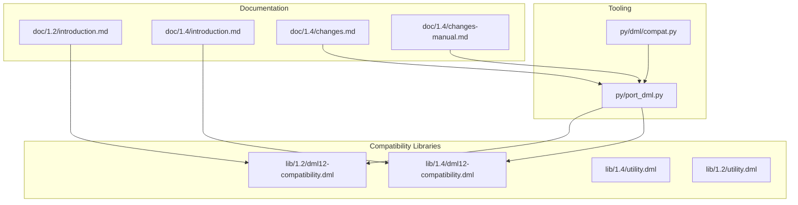
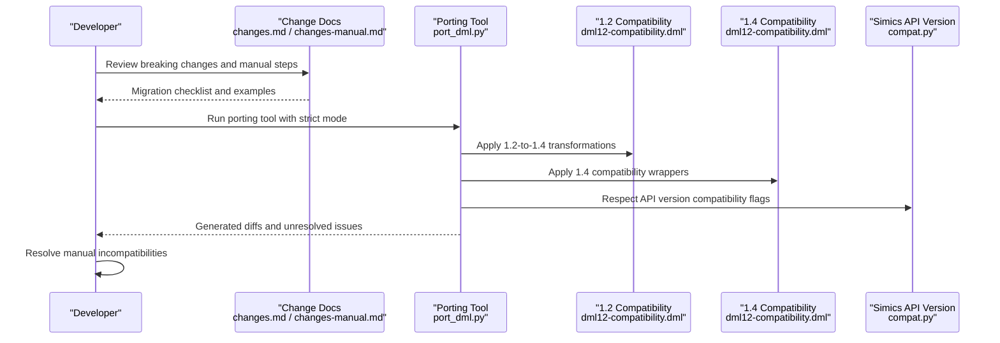
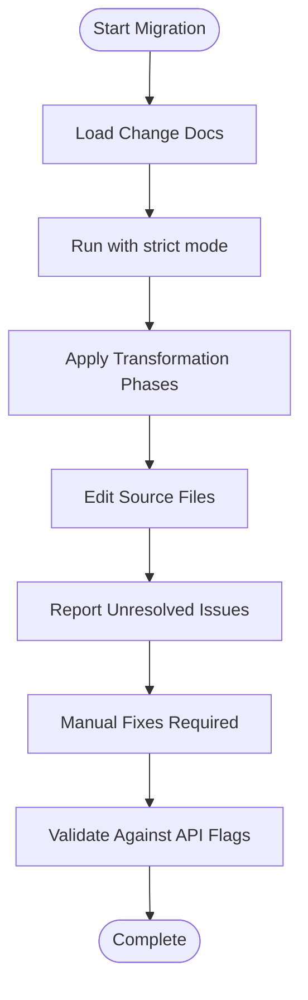
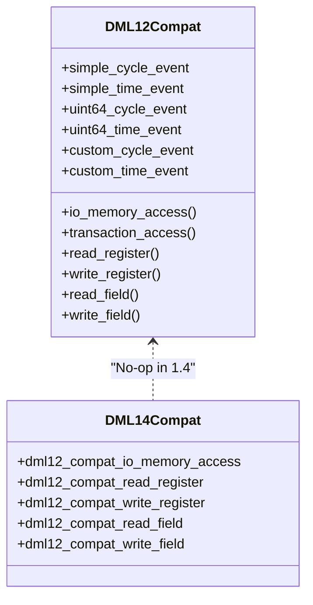
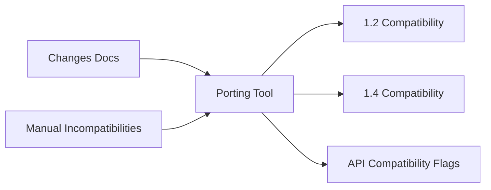

# Version Migration and Compatibility

<cite>
**Referenced Files in This Document**
- [README.md](file://README.md)
- [RELEASENOTES-1.2.md](file://RELEASENOTES-1.2.md)
- [RELEASENOTES-1.4.md](file://RELEASENOTES-1.4.md)
- [doc/1.2/introduction.md](file://doc/1.2/introduction.md)
- [doc/1.4/introduction.md](file://doc/1.4/introduction.md)
- [doc/1.4/changes.md](file://doc/1.4/changes.md)
- [doc/1.4/changes-manual.md](file://doc/1.4/changes-manual.md)
- [lib/1.2/dml12-compatibility.dml](file://lib/1.2/dml12-compatibility.dml)
- [lib/1.4/dml12-compatibility.dml](file://lib/1.4/dml12-compatibility.dml)
- [lib/1.4/utility.dml](file://lib/1.4/utility.dml)
- [lib/1.2/utility.dml](file://lib/1.2/utility.dml)
- [py/port_dml.py](file://py/port_dml.py)
- [py/dml/compat.py](file://py/dml/compat.py)
</cite>

## Table of Contents
1. [Introduction](#introduction)
2. [Project Structure](#project-structure)
3. [Core Components](#core-components)
4. [Architecture Overview](#architecture-overview)
5. [Detailed Component Analysis](#detailed-component-analysis)
6. [Dependency Analysis](#dependency-analysis)
7. [Performance Considerations](#performance-considerations)
8. [Troubleshooting Guide](#troubleshooting-guide)
9. [Conclusion](#conclusion)
10. [Appendices](#appendices)

## Introduction
This document explains how to migrate Device Modeling Language (DML) models from version 1.2 to 1.4, with a focus on compatibility layers, API version management, and backward compatibility mechanisms. It consolidates breaking changes, migration strategies, automated porting tools, and best practices. It also covers Simics API versioning and integration considerations during migration.

## Project Structure
The repository provides:
- Language documentation for both versions (1.2 and 1.4)
- Standard library compatibility shims for cross-version interoperability
- Automated porting scripts to assist with migration
- Compatibility features for Simics API versions

**Diagram sources**
- [doc/1.2/introduction.md](file://doc/1.2/introduction.md#L1-L34)
- [doc/1.4/introduction.md](file://doc/1.4/introduction.md#L1-L348)
- [doc/1.4/changes.md](file://doc/1.4/changes.md#L1-L249)
- [doc/1.4/changes-manual.md](file://doc/1.4/changes-manual.md#L1-L411)
- [lib/1.2/dml12-compatibility.dml](file://lib/1.2/dml12-compatibility.dml#L1-L470)
- [lib/1.4/dml12-compatibility.dml](file://lib/1.4/dml12-compatibility.dml#L1-L15)
- [lib/1.4/utility.dml](file://lib/1.4/utility.dml#L1-L800)
- [lib/1.2/utility.dml](file://lib/1.2/utility.dml#L1-L800)
- [py/port_dml.py](file://py/port_dml.py#L1-L800)
- [py/dml/compat.py](file://py/dml/compat.py#L1-L432)

**Section sources**
- [README.md](file://README.md#L1-L117)
- [doc/1.2/introduction.md](file://doc/1.2/introduction.md#L1-L34)
- [doc/1.4/introduction.md](file://doc/1.4/introduction.md#L1-L348)

## Core Components
- DML 1.2 to 1.4 migration guide and change matrix
- Automated porting tool with transformation phases
- Compatibility shim libraries for cross-version API bridging
- Simics API version compatibility features

Key migration resources:
- Changes overview and manual incompatibilities
- Porting tool with structured transformations
- Compatibility layers for events, reset, and register/field access
- API version compatibility toggles

**Section sources**
- [doc/1.4/changes.md](file://doc/1.4/changes.md#L1-L249)
- [doc/1.4/changes-manual.md](file://doc/1.4/changes-manual.md#L1-L411)
- [py/port_dml.py](file://py/port_dml.py#L1-L800)
- [lib/1.2/dml12-compatibility.dml](file://lib/1.2/dml12-compatibility.dml#L1-L470)
- [lib/1.4/dml12-compatibility.dml](file://lib/1.4/dml12-compatibility.dml#L1-L15)
- [py/dml/compat.py](file://py/dml/compat.py#L1-L432)

## Architecture Overview
The migration pipeline integrates documentation-driven change detection, automated transformations, and compatibility shims.

**Diagram sources**
- [doc/1.4/changes.md](file://doc/1.4/changes.md#L1-L249)
- [doc/1.4/changes-manual.md](file://doc/1.4/changes-manual.md#L1-L411)
- [py/port_dml.py](file://py/port_dml.py#L1-L800)
- [lib/1.2/dml12-compatibility.dml](file://lib/1.2/dml12-compatibility.dml#L1-L470)
- [lib/1.4/dml12-compatibility.dml](file://lib/1.4/dml12-compatibility.dml#L1-L15)
- [py/dml/compat.py](file://py/dml/compat.py#L1-L432)

## Detailed Component Analysis

### Migration Strategy and Change Matrix
- DML 1.4 introduces stricter semantics, new syntax, and revised APIs for registers, fields, attributes, events, and reset.
- Many 1.2 constructs are deprecated or removed (e.g., $-scoped identifiers, goto, certain template parameters).
- The change matrix documents incompatible changes and provides examples of before/after conversions.

Recommended migration steps:
- Use the strict mode flag to surface issues early.
- Apply automated transformations first, then resolve manual incompatibilities.
- Validate against Simics API version compatibility flags.

**Section sources**
- [doc/1.4/changes.md](file://doc/1.4/changes.md#L1-L249)
- [doc/1.4/changes-manual.md](file://doc/1.4/changes-manual.md#L1-L411)

### Automated Porting Tool (port_dml.py)
The porting tool applies staged transformations to migrate DML 1.2 code to 1.4 idioms:
- Phases include pruning nothrow annotations, adjusting method signatures, converting out-arg returns, and updating template instantiations.
- The tool maintains precise source locations and applies edits with offset translation to preserve line numbers and diagnostics.

Highlights:
- Transformation classes encapsulate specific edits (e.g., PNOTHROW, PINVOKE, PRETVAL).
- Supports strict mode to catch additional issues prior to migration.
- Generates deterministic diffs for review and incremental application.

**Diagram sources**
- [py/port_dml.py](file://py/port_dml.py#L1-L800)
- [doc/1.4/changes-manual.md](file://doc/1.4/changes-manual.md#L1-L411)

**Section sources**
- [py/port_dml.py](file://py/port_dml.py#L1-L800)

### Compatibility Layers
- 1.2 compatibility library: Bridges 1.4-style APIs into 1.2 runtime semantics, enabling overrides of transaction and register access methods, event templates, and reset behavior.
- 1.4 compatibility library: No-op when device is 1.4, ensuring unified codebases can target both versions.

Key compatibility features:
- Event templates: simple_cycle_event, simple_time_event, uint64 variants, custom variants.
- Reset templates: power_on_reset, hard_reset, soft_reset with port-based triggers.
- Register/field access compatibility wrappers for transaction and io_memory interfaces.

**Diagram sources**
- [lib/1.2/dml12-compatibility.dml](file://lib/1.2/dml12-compatibility.dml#L1-L470)
- [lib/1.4/dml12-compatibility.dml](file://lib/1.4/dml12-compatibility.dml#L1-L15)

**Section sources**
- [lib/1.2/dml12-compatibility.dml](file://lib/1.2/dml12-compatibility.dml#L1-L470)
- [lib/1.4/dml12-compatibility.dml](file://lib/1.4/dml12-compatibility.dml#L1-L15)
- [lib/1.4/utility.dml](file://lib/1.4/utility.dml#L1-L800)
- [lib/1.2/utility.dml](file://lib/1.2/utility.dml#L1-L800)

### API Version Management and Backward Compatibility
The compatibility module enumerates Simics API versions and features that alter behavior:
- Known API versions: 4.8, 5, 6, 7
- Features include lenient type checking, shared logs on device, method index assertions, and others with version-specific defaults.

Migration guidance:
- Enable or disable compatibility features based on target Simics API.
- Use flags to control behavior for legacy quirks and warnings.

**Section sources**
- [py/dml/compat.py](file://py/dml/compat.py#L1-L432)

### Simics API Versioning and Integration Considerations
- API versions influence attribute registration, log behavior, and type checking.
- Compatibility toggles can preserve legacy behavior during migration.
- Reset and event APIs changed in 1.4; compatibility layers ease transition.

**Section sources**
- [RELEASENOTES-1.2.md](file://RELEASENOTES-1.2.md#L1-L121)
- [RELEASENOTES-1.4.md](file://RELEASENOTES-1.4.md#L1-L362)
- [py/dml/compat.py](file://py/dml/compat.py#L1-L432)

## Dependency Analysis
The migration tool depends on:
- Change documentation for determining required edits
- Compatibility libraries for bridging 1.2 and 1.4 semantics
- API compatibility flags for runtime behavior

**Diagram sources**
- [doc/1.4/changes.md](file://doc/1.4/changes.md#L1-L249)
- [doc/1.4/changes-manual.md](file://doc/1.4/changes-manual.md#L1-L411)
- [py/port_dml.py](file://py/port_dml.py#L1-L800)
- [lib/1.2/dml12-compatibility.dml](file://lib/1.2/dml12-compatibility.dml#L1-L470)
- [lib/1.4/dml12-compatibility.dml](file://lib/1.4/dml12-compatibility.dml#L1-L15)
- [py/dml/compat.py](file://py/dml/compat.py#L1-L432)

**Section sources**
- [py/port_dml.py](file://py/port_dml.py#L1-L800)
- [lib/1.2/dml12-compatibility.dml](file://lib/1.2/dml12-compatibility.dml#L1-L470)
- [lib/1.4/dml12-compatibility.dml](file://lib/1.4/dml12-compatibility.dml#L1-L15)
- [py/dml/compat.py](file://py/dml/compat.py#L1-L432)

## Performance Considerations
- DML 1.4 improves compilation performance for large register banks.
- Compatibility layers add minimal overhead; prefer 1.4-native APIs where possible.
- Use strict mode to catch issues early and reduce downstream rework.

[No sources needed since this section provides general guidance]

## Troubleshooting Guide
Common migration issues and resolutions:
- Method signatures and return values: Convert out-arg returns to explicit returns and adjust method declarations.
- Event templates: Replace custom event patterns with predefined templates (simple, uint64, custom).
- Reset behavior: Replace hard_reset_value and soft_reset_value with init_val and soft_reset_val templates.
- Attribute types: Replace allocate_type with type-specific templates (uint64_attr, int64_attr, bool_attr, double_attr).
- $-scoped identifiers: Remove $ prefixes and merge top-level scope with global scope.
- goto statements: Remove or refactor into throw/catch patterns.
- Template parameters: Update deprecated parameters and instantiate required templates explicitly.

Validation tips:
- Use strict mode to surface additional errors.
- Review compatibility features and adjust API flags as needed.
- Test with Simics API version flags to ensure runtime behavior aligns with expectations.

**Section sources**
- [doc/1.4/changes-manual.md](file://doc/1.4/changes-manual.md#L1-L411)
- [py/port_dml.py](file://py/port_dml.py#L1-L800)
- [py/dml/compat.py](file://py/dml/compat.py#L1-L432)

## Conclusion
Migrating from DML 1.2 to 1.4 requires addressing syntax and API changes, leveraging automated transformations, and applying compatibility layers. By combining the change matrix, porting tool, and API compatibility features, teams can manage migration risks and maintain integration with Simics across API versions.

[No sources needed since this section summarizes without analyzing specific files]

## Appendices

### Appendix A: Migration Checklist
- Review change matrix and manual incompatibilities
- Run porting tool with strict mode
- Apply automated transformations
- Manually resolve remaining incompatibilities
- Validate against target Simics API version
- Test event, reset, and register/field access behavior

**Section sources**
- [doc/1.4/changes.md](file://doc/1.4/changes.md#L1-L249)
- [doc/1.4/changes-manual.md](file://doc/1.4/changes-manual.md#L1-L411)
- [py/port_dml.py](file://py/port_dml.py#L1-L800)